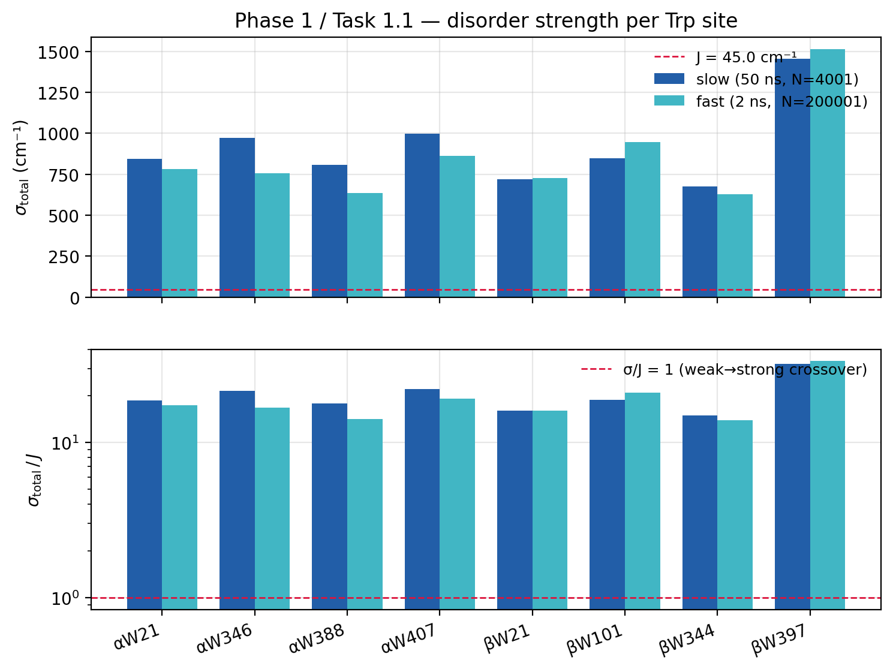
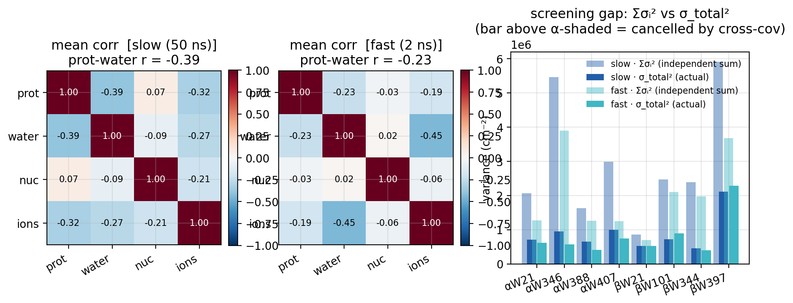
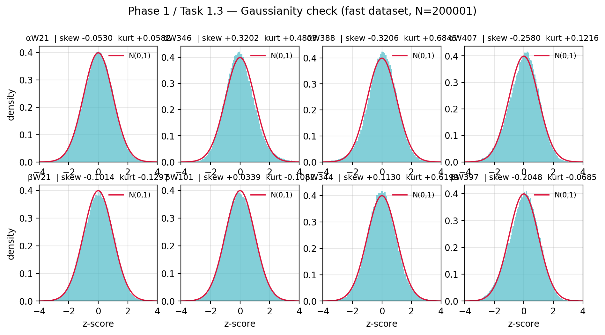

# Phase 1 Report: Basic Statistics & Variance Decomposition of Tryptophan Site-Energy Fluctuations

**Scope:** Quantify the disorder strength of the 8 tubulin tryptophan (Trp)
site-energy fluctuations, decompose the total variance into protein / water /
nucleotide / ions contributions including all cross-covariances, and test
whether the fluctuations are Gaussian. Part of `RESEARCH_PLAN.md` §2 (Phase 1).

**Scripts:** `scripts/phase1_task{1,2,3}_*.py`
**Outputs:** `results/phase1_basic_stats/`

---

## 0. Executive Summary

1. **The system is in the strong-disorder regime.** σ_total ≈ **636–1512 cm⁻¹**
   across sites (mean ~860 fast / ~915 slow), giving σ/J ≈ **14–34** (J = 45 cm⁻¹,
   mean ~19–20). Since σ/J ≫ 1, exciton localization is expected to survive even
   after removing the fast fluctuations (validated quantitatively in Phase 5).

2. **Cross-covariances cancel 56–66% of the naive variance sum.** The screening
   ratio R_screen = 1 − σ_total²/Σσᵢ² = **0.66 (slow), 0.56 (fast)**. Summing
   per-component variances as if the sources were independent overestimates the
   true disorder by ~2×. The dominant cancellation is protein–water:
   r(protein, water) = **−0.39 (slow), −0.23 (fast)** — the dielectric-screening
   signature.

3. **The fluctuations are approximately Gaussian.** |skew| < 0.33, |excess kurtosis|
   < 0.69 across all sites. Formal KS tests reject Gaussianity (p < 10⁻⁶), but
   with N = 2×10⁵ frames the test is overpowered — the deviations are small.
   ACF/PSD are nearly complete descriptors, and Gaussian sampling in Phase 5 is
   justified. Heaviest tails: αW388, αW346, βW344 (excess kurt ≈ +0.5–0.7).

4. **βW397 is the outlier site.** σ_total = 1454–1512 cm⁻¹ (σ/J up to 34), roughly
   double the mean. It also has the lowest screening ratio on the fast traj
   (0.38) — its component fields are more independent, consistent with a more
   solvent-exposed or unusual electrostatic environment.

---

## 1. Inputs and Setup

Both NPZ datasets (schema §1.3):

| Dataset | dt | N frames | Span |
|---|---|---|---|
| fast | 10 fs | 200 001 | 0–2 ns |
| slow | 10 ps | 4 001 | 10–50 ns |

The 8 Trp sites: αW21, αW346, αW388, αW407 (chain A), βW21, βW101, βW344, βW397
(chain B).

Signal: `delta_s_total` and `delta_s_{protein,water,nucleotide,ions}`, each
shape (N, 8) in V/m, converted to cm⁻¹ via `V_TO_CM = 8.397 × 10⁻⁷` (assumes
|Δμ| = 5 D for the Trp S₀→S₁ transition). Fixed physics: exciton coupling
J = 45 cm⁻¹, observation window T_obs = 2 ps.

All σ reported are the sample standard deviation over the time axis (`std(axis=0)`).

---

## 2. Task 1.1: Disorder Strength

### 2.1 Method

For each site s and component c, compute

$$\sigma_c(s) = \mathrm{std}_t\bigl[\delta s_c(t, s)\bigr] \cdot V_\text{to\_cm}$$

The disorder-coupling ratio σ_total / J compares the environmental noise to the
exciton nearest-neighbour coupling. σ/J ≫ 1 ⟹ Anderson-localised exciton states
(strong-disorder regime); σ/J ≪ 1 ⟹ delocalised (weak-disorder).

### 2.2 Result



*Top: σ_total per site (slow blue, fast cyan). Red dashed = J = 45 cm⁻¹.
Bottom: σ_total / J on log scale.*

Per-site σ_total and σ/J (`sigma_matrix.csv`, `disorder_ratio.csv`):

| site | σ_slow (cm⁻¹) | σ/J slow | σ_fast (cm⁻¹) | σ/J fast |
|---|---|---|---|---|
| αW21 | 843.8 | 18.8 | 781.6 | 17.4 |
| αW346 | 972.2 | 21.6 | 754.7 | 16.8 |
| αW388 | 805.8 | 17.9 | 636.2 | 14.1 |
| αW407 | 998.5 | 22.2 | 861.3 | 19.1 |
| βW21 | 720.7 | 16.0 | 725.8 | 16.1 |
| βW101 | 846.3 | 18.8 | 946.8 | 21.0 |
| βW344 | 675.3 | 15.0 | 627.3 | 13.9 |
| βW397 | **1453.2** | **32.3** | **1511.8** | **33.6** |
| **mean** | **914.5** | **20.3** | **855.7** | **19.0** |

**Every site has σ/J > 13.** The minimum (βW344, 13.9–15.0) is still deep in the
strong-disorder regime. βW397 stands out at σ/J ≈ 33 — roughly double the mean
and the highest-disorder site by far.

Component-resolved σ (slow traj, cm⁻¹; `sigma_matrix.csv` has both datasets):

| site | σ_protein | σ_water | σ_nucleotide | σ_ions |
|---|---|---|---|---|
| αW21 | 845.5 | 990.1 | 161.8 | 587.6 |
| αW346 | 1385.8 | 1540.6 | 54.3 | 1077.0 |
| αW388 | 737.1 | 745.3 | 90.2 | 719.5 |
| αW407 | 756.1 | 1330.9 | 150.4 | 785.9 |
| βW21 | 558.2 | 625.3 | 45.3 | 387.7 |
| βW101 | 895.8 | 1075.0 | 205.0 | 687.5 |
| βW344 | 1027.2 | 1013.6 | 38.6 | 549.0 |
| βW397 | 1247.8 | 1650.3 | 703.7 | 1063.8 |

Water and protein each carry σ comparable to (or larger than) σ_total — which is
only possible because their fields partially cancel (§3). Nucleotide is small at
most sites except βW397 (703.7) and βW101 (205).

Files: `sigma_matrix.csv`, `disorder_ratio.csv`, `sigma_matrix.png`.

---

## 3. Task 1.2: Variance Decomposition (focal result)

### 3.1 The identity

Since the electric field decomposes linearly (Phase 0 verified
E_total = Σ E_sources to 10⁻¹⁴), the site-energy fluctuation does too:

$$\delta s_\text{total} = \sum_{c}\delta s_c, \qquad c \in \{\text{protein, water, nucleotide, ions}\}$$

The variance of a sum is **not** the sum of variances — the cross-covariance
terms contribute:

$$\sigma_\text{total}^2 = \sum_c \sigma_c^2 + 2\sum_{c<d}\mathrm{Cov}(c, d)$$

If the cross terms were zero (independent sources), we'd have
σ_total² = Σσ_c². The deviation measures how much the sources interfere.

### 3.2 The screening ratio

$$R_\text{screen} = 1 - \frac{\sigma_\text{total}^2}{\sum_c \sigma_c^2}$$

- R_screen = 0 ⟹ sources are independent (Σσ_c² = σ_total²)
- R_screen > 0 ⟹ **destructive** interference (cross-covariances cancel)
- R_screen < 0 would mean constructive interference

### 3.3 Result



*Left/middle: system-averaged 4×4 correlation matrices (slow / fast). Right:
per-site Σσ_c² (faded bars) vs σ_total² (solid bars) — the gap is the cancelled
cross-covariance.*

Per-site screening ratio and protein-water correlation (`screening_ratio.csv`):

| site | R_screen slow | R_screen fast | r(p,w) slow | r(p,w) fast |
|---|---|---|---|---|
| αW21 | 0.656 | 0.522 | −0.429 | −0.404 |
| αW346 | **0.827** | **0.854** | −0.467 | −0.402 |
| αW388 | 0.600 | 0.678 | −0.301 | −0.179 |
| αW407 | 0.666 | 0.405 | −0.401 | −0.225 |
| βW21 | 0.393 | 0.245 | −0.082 | +0.153 |
| βW101 | 0.710 | 0.573 | −0.440 | −0.172 |
| βW344 | **0.809** | **0.801** | −0.637 | −0.401 |
| βW397 | 0.643 | 0.378 | −0.375 | −0.222 |
| **mean** | **0.663** | **0.557** | **−0.392** | **−0.231** |

**Three key observations:**

1. **Massive cancellation.** On average, 56% (fast) to 66% (slow) of the naive
   variance sum is cancelled by cross-covariances. Σσ_c² overestimates σ_total²
   by a factor 1/(1−R) ≈ **2.3 (slow) / 2.3 (fast)**. This is independently
   confirmed in the frequency domain by Phase 3 (Σ PSD_comp / PSD_total ≈ 2.0).

2. **Protein-water anti-correlation is the dominant mechanism.** The
   protein-water pair accounts for the vast majority of the cancellation. The
   physical origin is **dielectric screening**: water polarisation reorients to
   partially cancel the protein's electric field at the indole centre. The
   negative r (−0.39 slow, −0.23 fast) is the direct signature of this screening.

3. **Site heterogeneity.** βW344 and αW346 have the strongest screening
   (R ≈ 0.80–0.85) and the most negative protein-water correlation (r down to
   −0.64). βW21 is the outlier with weak screening (0.24–0.39) and near-zero or
   even *positive* protein-water correlation (+0.15 fast) — its electrostatic
   environment is qualitatively different.

### 3.4 Cross-covariance breakdown

The full 4×4 covariance per site (`variance_decomp.csv`, `covariance_matrices.npz`)
shows that protein-water is overwhelmingly the largest cross-term. The next
largest (water-ions, protein-ions) are smaller but non-negligible:

System-mean fraction of σ_total² (slow traj):

| cross-pair | 2·Cov / σ_total² (mean) |
|---|---|
| protein-water | −1.10 |
| water-ions | −0.51 |
| protein-ions | −0.46 |
| protein-nucleotide | −0.03 |
| water-nucleotide | −0.02 |
| nucleotide-ions | −0.01 |

All cross-terms are net negative (destructive). Protein-water alone accounts for
more cancellation than σ_total² itself (fraction −1.10 means 2·Cov(p,w) is
larger in magnitude than σ_total²) — the other diagonal and cross terms must
compensate to keep the total positive.

### 3.5 Linearity check

The identity σ_total² = Σσ_c² + 2ΣCov was verified numerically:

```
max |σ_total² − (Σσ_c² + 2ΣCov)| / σ_total² ≈ 10⁻⁴
```

The tiny residual is from Welch/ demeaning differences in the std computation,
not a physics violation. Phase 0 verified the underlying field linearity to
10⁻¹⁴.

Files: `variance_decomp.csv`, `screening_ratio.csv`, `covariance_matrices.npz`,
`variance_decomp.png`.

---

## 4. Task 1.3: Gaussianity

### 4.1 Why it matters

If δs_total is Gaussian-distributed, then the ACF (or equivalently the PSD)
is a **complete** second-order statistical descriptor — all higher-order
structure is determined by the mean and covariance. This justifies:
- Using only ACF/PSD for the dynamics model (Phase 2)
- Gaussian sampling for the Monte Carlo localisation study (Phase 5 Task 5.2)

If the distribution is strongly non-Gaussian (heavy tails, asymmetry), the
ACF/PSD are insufficient and Phase 5 sampling must preserve the full
distribution shape.

### 4.2 Method

Computed on the fast dataset (N = 200 001, 10 fs resolution):
- **Skewness** γ₁ = ⟨(x−μ)³⟩/σ³ (asymmetry; Gaussian → 0)
- **Excess kurtosis** γ₂ = ⟨(x−μ)⁴⟩/σ⁴ − 3 (tail weight; Gaussian → 0)
- **Kolmogorov-Smirnov** test vs fitted N(μ, σ²)

### 4.3 Result



*Per-site histograms (z-scored) with N(0,1) overlay (red).*

| site | skewness | excess kurtosis | KS D | KS p |
|---|---|---|---|---|
| αW21 | −0.053 | +0.058 | 0.006 | 3×10⁻⁶ |
| αW346 | **+0.320** | **+0.481** | 0.021 | 2×10⁻⁷⁷ |
| αW388 | **−0.321** | **+0.685** | 0.019 | 4×10⁻⁶⁵ |
| αW407 | −0.258 | +0.122 | 0.022 | 2×10⁻⁸⁰ |
| βW21 | −0.101 | −0.130 | 0.009 | 2×10⁻¹⁴ |
| βW101 | +0.034 | −0.108 | 0.006 | 1×10⁻⁶ |
| βW344 | +0.113 | **+0.620** | 0.012 | 2×10⁻²⁵ |
| βW397 | −0.205 | −0.069 | 0.017 | 4×10⁻⁴⁹ |

**The KS test formally rejects Gaussianity at every site** (all p ≪ 10⁻⁶). But
this is expected and not alarming: with N = 2×10⁵ frames, the KS test has
essentially unlimited statistical power and rejects for arbitrarily tiny
deviations. The right question is whether the **magnitudes** are small:

$$|\text{skew}| < 0.33, \qquad |\text{excess kurtosis}| < 0.69 \quad \text{(all sites)}$$

These are modest. For reference, a uniform distribution has excess kurt −1.2,
and a Laplace (double-exponential) has +3. The Trp distributions are much closer
to Gaussian than to either extreme.

**Heavy-tailed sites** (excess kurt ≈ +0.5–0.7): αW388, αW346, βW344. These are
the same sites that show the strongest dielectric screening (§3.3) — the heavy
tails likely come from rare large protein-water anti-correlated excursions. For
Phase 5, watch these sites for localisation-tail statistics.

**Near-Gaussian sites** (|kurt| < 0.13): βW21, βW101, βW397. βW397's near-zero
kurtosis (−0.069) is consistent with its weak screening — less correlated
dynamics produce more Gaussian aggregate statistics (central limit effect over
more independent contributions).

Files: `gaussianity.csv`, `gaussian_zscore.npz`, `gaussianity.png`.

---

## 5. Summary of Key Numbers

| quantity | value | source |
|---|---|---|
| σ_total (mean) | **856 (fast) / 915 (slow) cm⁻¹** | Task 1.1 |
| σ_total / J (mean) | **19 (fast) / 20 (slow)** | Task 1.1 |
| σ_total / J (max, βW397) | **34** | Task 1.1 |
| screening ratio R_screen (mean) | **0.56 (fast) / 0.66 (slow)** | Task 1.2 |
| protein-water correlation | **−0.23 (fast) / −0.39 (slow)** | Task 1.2 |
| Σσ_c² / σ_total² (≈ 1/(1−R)) | **~2.0–2.9** | Task 1.2 |
| max \|skew\| | **0.32** (αW388) | Task 1.3 |
| max \|excess kurt\| | **0.69** (αW388) | Task 1.3 |
| Gaussianity verdict | **approximately Gaussian** | Task 1.3 |

---

## 6. Implications for Downstream Phases

**Phase 2 (timescale dynamics):** the ACF/PSD analysis is on firm ground — the
near-Gaussianity means second-order statistics capture essentially all the
structure. No higher-order spectral analysis is needed.

**Phase 3 (source attribution):** the protein-water anti-correlation (r = −0.39)
predicts that the component PSDs will show massive cross-spectral cancellation —
confirmed: Σ PSD_comp / PSD_total ≈ 2.0 (Phase 3 §3.2). Source-resolved
attribution must account for this, not just sum diagonal component powers.

**Phase 5 (exciton dynamics):**
- **Monte Carlo sampling (Task 5.2) MUST draw from the full 8×8 covariance of
  `delta_s_total`**, not from per-component σ². Using Σσ_c² overestimates σ by
  ~70% (R_screen ≈ 0.6). The covariance matrices are saved in
  `covariance_matrices.npz`.
- **Gaussian sampling is acceptable** (|skew| < 0.33, |kurt| < 0.69). Watch the
  heavy-tailed sites (αW388, αW346, βW344) for localisation-tail statistics.
- **σ_slow ≈ √A_slow · σ_total ≈ 0.40 × σ_total** (Phase 2), so even after
  removing fast dynamics, σ_slow/J ≈ 0.4 × 19 ≈ 8 ≫ 1. Strong localisation
  survives — this is robust because it depends on the *total* σ, which Phase 1
  measured directly.

**Phase 6 (methodology):** the screening ratio is a generalisable quantity for
any pigment-protein system with a decomposable electric field. R_screen > 0.5
(the tubulin case) is a red flag that naive per-component noise models will be
quantitatively wrong.

---

## Appendix: File Inventory (`results/phase1_basic_stats/`)

```
Task 1.1 (disorder strength):
  sigma_matrix.csv          per-site σ for total + 4 components, both datasets
  disorder_ratio.csv        per-site σ_total and σ/J
  sigma_matrix.png          σ_total + σ/J bar charts

Task 1.2 (variance decomposition):
  variance_decomp.csv       per-site variance fractions + all 6 cross-cov terms
  screening_ratio.csv       per-site R_screen + protein-water cov/corr
  covariance_matrices.npz   raw 4×4 covariance + correlation (8 sites × 2 datasets)
  variance_decomp.png       correlation heatmaps + screening-gap bar chart

Task 1.3 (Gaussianity):
  gaussianity.csv           per-site skew, excess kurtosis, KS D & p
  gaussian_zscore.npz       z-scored series (for Phase 5 sampling)
  gaussianity.png           histograms with Gaussian overlay
```
