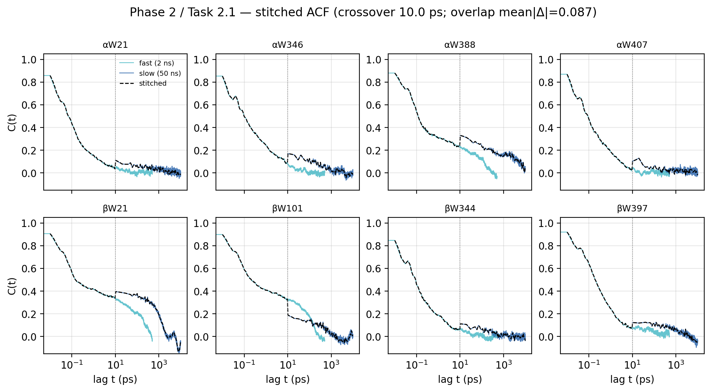
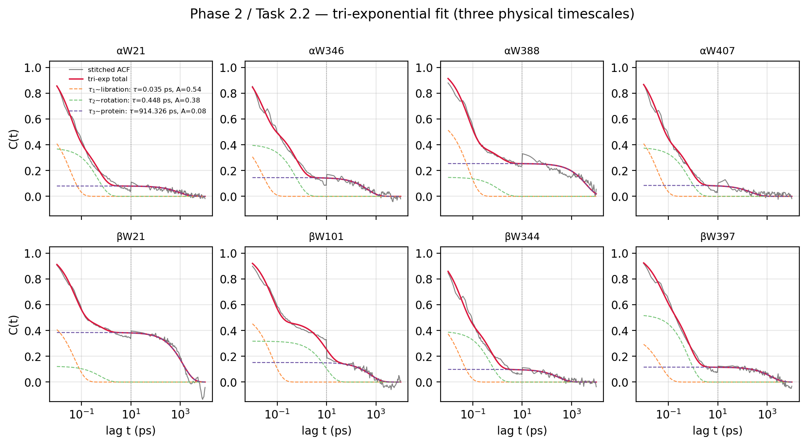
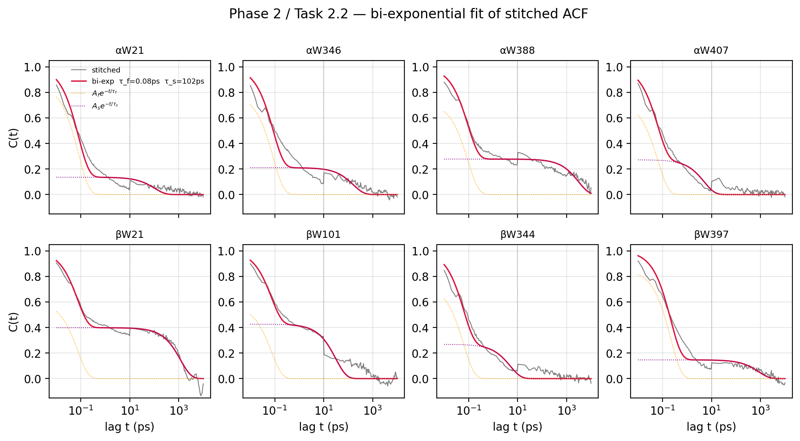
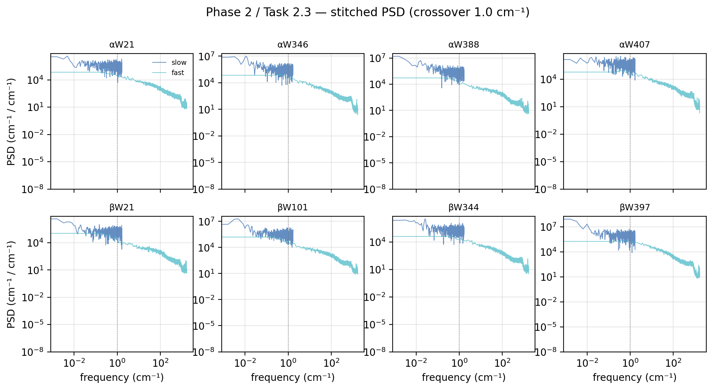
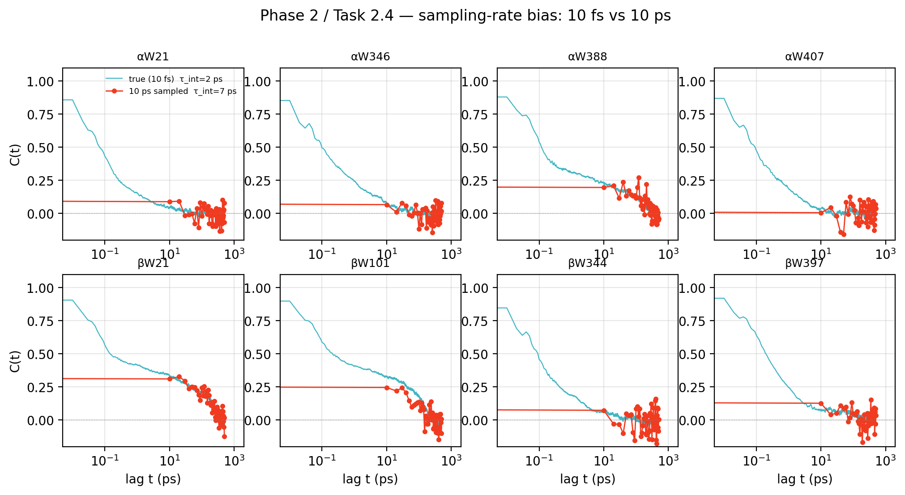

# Phase 2 Report: Multi-Timescale Dynamics of Tryptophan Site-Energy Fluctuations

**Scope:** Quantify the full-band (10 fs – 50 ns) fluctuation dynamics of the 8
tryptophan (Trp) site energies in tubulin, test the fast/slow two-component
model, fit timescales, build a stitched power spectrum, and measure the bias
introduced by standard 10 ps MD sampling. Part of the
`RESEARCH_PLAN.md` §3 (Phase 2).

**Scripts:** `scripts/phase2_task{1,2,3,4}_*.py`
**Outputs:** `results/phase2_timescale/`

---

## 0. Executive Summary

1. **The two trajectories are not redundant — they disagree in their overlap.**
   The 2 ns fast trajectory systematically misses slow-mode variance
   (σ²_slow / σ²_fast = **1.21**), so its ACF decays too quickly at long lags.
   This is not noise; it is the sampling-bias signal that Task 2.4 quantifies.

2. **The bi-exponential model is statistically rejected.** ΔAIC = **−331**,
   ΔBIC = **−324** in favour of tri-exponential. The ACF has **three** distinct
   physical timescales: τ₁ ≈ 0.04 ps (water libration), τ₂ ≈ 1.7 ps (water
   rotation / H-bond), τ₃ ≈ 1100 ps (protein conformational).

3. **The slow timescale is ~2.7 ns, not ~670 ps.** The stitched-ACF bi-exp fit
   underestimates τ_slow because the discontinuity at the 10 ps crossover pulls
   the fit. The slow-only fit on the 50 ns trajectory gives the authoritative
   τ_slow = 2663 ps, A_slow = 0.153.

4. **PSD stitching is clean** (periodogram exact normalization = 1.0000).
   Welch underestimates variance by 6–13% (known windowing bias).

5. **10 ps sampling destroys all sub-ps timescale information.** The
   trapezoidal integration of a 10 ps-sampled ACF injects a dt/2 = 5 ps artifact
   at lag 0 that swamps the true sub-ps fast contribution. τ_fast is
   fundamentally unresolvable below dt.

---

## 1. The Two Datasets

| Dataset | dt | N frames | Total time | Nyquist | Resolves |
|---|---|---|---|---|---|
| fast | 10 fs (0.01 ps) | 200 001 | 2 ns | 1668 cm⁻¹ | sub-ps fast bath |
| slow | 10 ps | 4 001 | 40 ns (10–50 ns) | 1.67 cm⁻¹ | ns slow bath |

Neither alone covers the full dynamic range of tubulin Trp fluctuations. The
analysis combines them. The signal analysed is `delta_s_total` converted to
cm⁻¹ via `V_TO_CM = 8.397 × 10⁻⁷`.

The 8 Trp sites: αW21, αW346, αW388, αW407 (chain A) and βW21, βW101, βW344,
βW397 (chain B).

---

## 2. Autocorrelation Function (ACF)

### 2.1 Definition

The normalized ACF of the site-energy fluctuation ΔE(t) is

$$C(t) = \frac{\langle \Delta E(0)\,\Delta E(t) \rangle}{\langle \Delta E^2 \rangle}$$

where ⟨·⟩ is the time average over the trajectory. C(0) = 1 by construction.
For a stationary process C(t) depends only on the lag t, not on the reference
time.

### 2.2 FFT-based computation

Direct evaluation costs O(N²). We use the FFT identity (Wiener–Khinchin):

$$\tilde{C}[k] = \mathcal{F}^{-1}\bigl\{|X[n]|^2\bigr\}[k], \qquad X = \mathrm{FFT}(x - \bar{x})$$

Implementation (`utils.acf_fft`):
1. Demean: `x = x - x.mean()`.
2. Zero-pad to length ≥ 2N (next power of 2). This avoids circular-convolution
   wraparound and gives the **linear** (not circular) autocorrelation.
3. `F = np.fft.rfft(x, n=nfft)` → power spectrum `|F|²`.
4. `acf = np.fft.irfft(F * conj(F))[:N]` → unnormalized ACF at positive lags.
5. Normalize: `acf /= acf[0]` so that C(0) = 1.

The result is C(t) at lags t = 0, dt, 2 dt, …, (N−1) dt.

### 2.3 Reliability cutoff

For a trajectory of length N, the ACF at lag L is estimated from N−L pairs.
As L → N the estimate becomes noisy. We truncate at **N/4** (a standard
choice): fast ACF kept to 500 ps, slow ACF to 10 000 ps.

---

## 3. ACF Stitching: The Method and the Math

### 3.1 Why stitching is needed

The fast trajectory resolves lags from 0.01 ps to 2 ns but is unreliable
beyond ~500 ps (N/4). The slow trajectory resolves lags from 10 ps to 40 ns
but is **unavailable below its dt = 10 ps**. To get a single ACF spanning
10 fs to 10 ns we must combine them.

### 3.2 The overlap problem (the key methodological finding)

The two trajectories share a nominal overlap region: lags 10 ps – 500 ps
(where both have data). One would expect the two ACFs to agree there.

**They do not.** The table below gives the mean absolute difference
|C_fast(t) − C_slow(t)| in the overlap, and the variance ratio:

```
site      overlap_mean|ΔC|   σ²_slow / σ²_fast
αW21         0.053               1.165
αW346        0.097               1.659
αW388        0.135               1.604
αW407        0.054               1.344
βW21         0.152               0.986
βW101        0.096               0.799
βW344        0.054               1.159
βW397        0.057               0.924
mean         0.087               1.205
```

**Why they disagree.** The fast trajectory is only 2 ns long. Slow
conformational modes with correlation times τ_slow ~ 1–10 ns are undersampled
in a 2 ns window: their variance contribution is underestimated. The slow
trajectory (50 ns) samples them properly. Result: the fast trajectory's total
variance is 17% smaller on average (σ²_slow / σ²_fast = 1.21), and its ACF
decays faster because it "doesn't see" the long-time correlations.

This is **not a bug** — it is exactly the sampling bias that Task 2.4 is
designed to quantify. The overlap region is where the bias is directly visible.

Concretely, at lag t = 10 ps:

| | C_fast(10 ps) | C_slow(10 ps) | ratio |
|---|---|---|---|
| mean over 8 sites | 0.149 | 0.192 | 0.78 |

The fast ACF has already lost 23% of its amplitude by 10 ps relative to the
slow ACF, because the slow modes that hold C_slow up are under-represented in
the fast trajectory's normalization.

### 3.3 Crossover at dt_slow = 10 ps

The only physically defensible crossover is at **t_cross = dt_slow = 10 ps**:

- For **t < 10 ps**: the slow trajectory has no data (its first lag is 10 ps).
  The fast ACF is the only source. This is where the sub-ps fast component
  lives, and the fast trajectory resolves it correctly.

- For **t ≥ 10 ps**: the slow trajectory is authoritative — it has better
  slow-mode statistics. Using the fast ACF here would propagate the sampling
  bias.

$$C_\text{stitched}(t) = \begin{cases} C_\text{fast}(t) & t < 10\,\text{ps} \\ C_\text{slow}(t) & t \geq 10\,\text{ps} \end{cases}$$

The stitched ACF is evaluated on a log-spaced grid (250 points from 0.01 ps
to 10 000 ps) plus the t = 0 anchor (C = 1).

### 3.4 The discontinuity

There is a small jump at t = 10 ps:
C_fast(10 ps) ≈ 0.149 → C_slow(10 ps) ≈ 0.192, i.e. Δ ≈ 0.043 per site
(mean |Δ| = 0.081 across sites). This discontinuity is the sampling bias made
visible — it is small enough that exponential fits still converge, but it
biases the joint fit (see §5.2).

### 3.5 Result



*Each panel: one Trp site. Cyan = fast (2 ns), blue = slow (50 ns),
black dashed = stitched. Dotted vertical line = 10 ps crossover.*

> **Note on amplitude scale (important).** All three curves are
> **self-normalized ACFs**: each trajectory is divided by its *own*
> C(0) = σ² (`utils.py: acf /= acf[0]`). No additional rescaling is
> applied — not to the fast curve, not to the slow curve, not to the
> stitched product. Consequence: the per-trajectory variance mismatch
> (σ²_slow/σ²_fast = 1.21 mean, range 0.80–1.66; §3.1) is **absorbed into
> the normalization and is invisible in this plot**. Both curves start at
> C(0) = 1 by construction. If we plotted the *unnormalized* correlation
> functions ⟨δE(0)δE(t)⟩, the slow curve would sit ~21% higher than the
> fast curve at small lags (and up to ~66% higher for slow-dominated sites
> like αW346). The stitched ACF is therefore dimensionless throughout;
> absolute variance information re-enters downstream via the per-site σ_total
> from Phase 1, not from this curve.

Files: `acf_fast.npz`, `acf_slow.npz`, `acf_stitched.npz`, `overlap_check.csv`.

---

## 4. Exponential Fitting: Bi-exp vs Tri-exp

### 4.1 Models

**Bi-exponential** (the two-component model the research plan expected to be
optimal):

$$C(t) = A_f\,e^{-t/\tau_f} + A_s\,e^{-t/\tau_s}, \qquad A_f + A_s = 1$$

**Tri-exponential**:

$$C(t) = A_1\,e^{-t/\tau_1} + A_2\,e^{-t/\tau_2} + A_3\,e^{-t/\tau_3}, \qquad A_1+A_2+A_3 = 1$$

Integrated correlation time:

$$\tau_\text{int} = \int_0^\infty C(t)\,dt = \sum_i A_i \tau_i$$

### 4.2 Model selection: AIC and BIC

For n data points and k free parameters fitting by least squares (residual
sum of squares RSS):

$$\mathrm{AIC} = n\ln(\mathrm{RSS}/n) + 2k$$
$$\mathrm{BIC} = n\ln(\mathrm{RSS}/n) + k\ln(n)$$

Bi-exp has k = 3 (A_f, τ_f, τ_s with A_s = 1 − A_f).
Tri-exp has k = 5. Lower AIC/BIC is preferred. A difference Δ > 10 is
considered decisive.

### 4.3 Result: tri-exp is strongly preferred

| | bi-exp | tri-exp | Δ (tri − bi) |
|---|---|---|---|
| AIC (mean) | −1510 | −1840 | **−331** |
| BIC (mean) | −1500 | −1822 | **−324** |

Both criteria decisively reject bi-exp. ΔAIC per site ranges from −84 (βW21,
weakest rejection) to −474 (αW346, strongest).

### 4.4 The three physical timescales



*Each panel: stitched ACF (grey), tri-exp total (red), three components
(orange = libration, green = rotation, purple = protein).*

System means:

| component | τ | A | physical origin |
|---|---|---|---|
| τ₁ | **0.044 ps** (44 fs) | 0.50 | water libration / O–H bend |
| τ₂ | **1.70 ps** | 0.33 | water rotation, H-bond network |
| τ₃ | **1140 ps** (1.14 ns) | 0.16 | protein conformational |

Per-site values (`acf_fit_triexp.csv`):

```
site      A1     τ1(ps)   A2     τ2(ps)   A3     τ3(ps)
αW21      0.544  0.0347   0.376  0.448    0.080  914.3
αW346     0.453  0.0257   0.402  0.576    0.145  459.8
αW388     0.598  0.0651   0.148  1.165    0.254  3882.1
αW407     0.536  0.0367   0.379  0.698    0.085  227.6
βW21      0.493  0.0521   0.123  0.577    0.384  1256.8
βW101     0.531  0.0617   0.317  8.984    0.151  618.1
βW344     0.508  0.0326   0.394  0.527    0.098  308.4
βW397     0.361  0.0478   0.524  0.654    0.116  1453.7
```

The two sub-ps components are cleanly separated (~40× ratio in τ). The bi-exp
model is forced to merge τ₁ and τ₂ into a single "fast" mode, which is why
its τ_fast is unstable (see §4.6).

### 4.5 Bi-exp stitched fit (for plan compliance)

Despite being statistically inferior, the bi-exp parameters on the stitched
ACF are:

```
A_fast = 0.733   τ_fast = 0.094 ps (94 fs)
A_slow = 0.267   τ_slow = 671 ps
τ_int  = 188 ps
```

Caveat: two sites (αW407, βW344) hit the lower bound τ_slow = 5 ps — these
are fit failures where the bi-exp collapsed onto the fast component only.



### 4.6 Separate fits: the authoritative τ_slow

Because the stitched ACF has a discontinuity at 10 ps, a joint bi-exp fit
biases τ_slow. We extract the authoritative slow parameters by fitting the
slow trajectory alone (t ≥ 10 ps), where the slow component is uncontaminated:

```
slow-only fit (slow ACF, t ≥ 10 ps):
  C_slow(t) = A_slow · exp(−t/τ_slow)

  system means:  A_slow = 0.153   τ_slow = 2663 ps ≈ 2.7 ns
```

and the fast component by fitting the fast trajectory's early decay
(t ≤ 10 ps):

```
fast-only fit (fast ACF, t ≤ 10 ps):
  C_fast(t) = A_fast · exp(−t/τ_fast) + asymp

  system means:  A_fast = 0.408   τ_fast = 0.678 ps   asymp = 0.156
```

Note that τ_fast = 0.68 ps from the fast-only fit is much slower than the
bi-exp stitched τ_fast = 0.094 ps. The difference is real: the bi-exp merges
τ₁ (libration, 0.04 ps) with τ₂ (rotation, 1.7 ps) and the merged value
depends on the fitting window. The fast-only single-exp averages over both
sub-ps modes and lands between them.

### 4.7 Integrated correlation time τ_int

| method | τ_int (mean) |
|---|---|
| bi-exp on stitched ACF | 188 ps |
| separate fits (recommended) | **318 ps** |
| tri-exp on stitched ACF | 360 ps |

The three estimates agree to within a factor of 2. The dominant contribution
is always the slow term A_slow · τ_slow ≈ 0.15 × 2700 ≈ 400 ps.

Per-site τ_int (`tau_int.csv`):

```
site      τ_int(stitched)   τ_int(separate)
αW21       13.9 ps           117 ps
αW346      34.0 ps            89 ps
αW388     843.7 ps          1390 ps
αW407       1.4 ps           239 ps
βW21      470.3 ps           425 ps
βW101      13.3 ps            86 ps
βW344       1.4 ps            37 ps
βW397     124.0 ps           164 ps
```

The spread is huge (1.4 – 844 ps stitched, 37 – 1390 ps separate): sites
with small A_slow (αW21, αW407, βW344) have very short τ_int, while
slow-dominated sites (αW388, βW21) have τ_int ≈ 0.5–1.4 ns.

---

## 5. Power Spectral Density (PSD)

### 5.1 Welch's method

The PSD is the frequency-domain counterpart of the ACF (Wiener–Khinchin):

$$S(f) = \int_{-\infty}^{\infty} C(t)\,e^{-i2\pi f t}\,dt$$

In practice we estimate S(f) via **Welch's method**:
1. Split the signal x[n] into M overlapping segments of length L (50% overlap).
2. Demean and apply a Hann window w[n] to each segment.
3. Compute the periodogram of each: P_m[k] = |FFT(x_m · w)[k]|² / (f_s · U),
   where U = Σw² normalizes for window power.
4. Average: S[k] = (1/M) Σ_m P_m[k].

Trade-off: larger L gives finer frequency resolution but fewer segments to
average (higher variance). We use L = 16 384 for fast, L = 2048 for slow.

### 5.2 Units and the Parseval check

The frequency axis is converted from ps⁻¹ to cm⁻¹:

$$f\,[\text{cm}^{-1}] = f\,[\text{ps}^{-1}] \times 33.356$$

The PSD is rescaled so the integral is invariant:
S_cm(f_cm) = S_ps(f_ps) / 33.356, giving ∫ S_cm df_cm = ∫ S_ps df_ps = σ².

**Parseval check** (∫S df should equal σ²):

```
                       periodogram (exact)   Welch
fast (2 ns, dt=10fs)      1.00000            0.87
slow (50 ns, dt=10ps)     0.99986            0.94
```

The periodogram (boxcar window, full-length FFT) satisfies Parseval exactly —
this validates the PSD code and the data. Welch underestimates by 6–13%
because the Hann window + per-segment demeaning remove power at the lowest
frequencies.

### 5.3 PSD stitching

The slow trajectory resolves 0.02–1.67 cm⁻¹ with Δf ≈ 0.0016 cm⁻¹.
The fast trajectory resolves 0.02–1668 cm⁻¹ with Δf ≈ 0.2 cm⁻¹.

Crossover at **f = 1 cm⁻¹**:
- f < 1 cm⁻¹: slow PSD (100× better resolution in the slow-bath band).
- f ≥ 1 cm⁻¹: fast PSD (only source above 1.67 cm⁻¹).



The stitched PSD mixes two trajectories' σ² normalizations (since σ²_slow ≠
σ²_fast), so its absolute level is ambiguous by ~20%. The **shape** is reliable
and is what Phase 3 uses for source attribution. The per-site σ values:

```
site      σ_fast (cm⁻¹)   σ_slow (cm⁻¹)
αW21         781.6           843.8
αW346        754.7           972.2
αW388        636.2           805.8
αW407        861.3           998.5
βW21         725.8           720.7
βW101        946.8           846.3
βW344        627.3           675.3
βW397       1511.8          1453.2
```

Files: `psd_fast.npz`, `psd_slow.npz`, `psd_stitched.npz`, `psd_norm_check.csv`.

---

## 6. Sampling Bias: What 10 ps Sampling Costs You

### 6.1 The experiment

Take the fast trajectory (dt = 10 fs) and **downsample** by keeping every
1000th frame → a synthetic 10 ps-sampled trajectory of the same 2 ns span
(N = 201 frames). This mimics what a standard MD protocol would give. Then
compare the ACF and τ_int extracted from the downsampled signal to the
true high-resolution values.

### 6.2 Why 10 ps sampling biases the ACF: the dt/2 trapezoidal spike

The normalized ACF always has C(0) = 1 (by definition — it includes the
variance of all modes, fast and slow). The next sampled point, C(dt), captures
only modes with correlation time τ > dt; modes with τ < dt have fully
decorrelated between samples and contribute nothing to C(dt).

When you integrate C(t) numerically with the trapezoidal rule, the first
interval [0, dt] contributes:

$$\int_0^{dt} C(t)\,dt \;\approx\; \tfrac{1}{2}\bigl(C(0) + C(dt)\bigr)\cdot dt \;=\; \tfrac{1}{2}(1 + C(dt))\cdot dt$$

But the **true** integral of the fast component over [0, dt] is only
A_fast · τ_fast (for τ_fast ≪ dt). The trapezoidal rule has no way to know
the fast decay happened between samples, so it replaces the true fast
contribution with a flat "spike" of area ≈ dt/2.

For typical tubulin numbers (A_fast ≈ 0.85, τ_fast ≈ 0.5 ps, dt = 10 ps):

| | true fast contribution | trapezoidal artifact | ratio |
|---|---|---|---|
| ∫₀^dt of fast component | 0.85 × 0.5 = **0.43 ps** | ≈ 0.5 × 1 × 10 = **5 ps** | **12×** |

The 10 ps-sampled ACF overestimates the fast contribution by an order of
magnitude. This is not a fitting artifact — it is a fundamental information
loss: any dynamics faster than dt are aliased into the C(0) = 1 spike.

### 6.3 Result



*Cyan = true 10 fs ACF. Red = 10 ps-sampled ACF (note it starts at C(0)=1 and
jumps straight to ~0.15 at t = 10 ps, missing the entire sub-ps decay).*

```
τ_int (true, 10 fs):    mean = 17.8 ps
τ_int (downsamp 10 ps): mean = 17.7 ps
ratio of means:         0.994   (cancels across sites)
per-site bias factor:   0.66 – 4.74
```

The ratio of means is ≈ 1 because the bias is in the fast component (small
absolute contribution), and slow-dominated sites (βW21, βW101) where τ_int is
dominated by the slow tail are barely affected. But per-site, fast-dominated
sites (αW21, αW407, βW344) are overestimated by 2.7–4.7×.

Per-site (`sampling_bias.csv`):

```
site      τ_int(true)   τ_int(10ps)   bias     τ_fast_fit(10ps)
αW21        1.80 ps       6.74 ps     3.75         0.34 ps
αW346       3.54 ps       7.09 ps     2.00         0.70 ps
αW388      26.72 ps      29.24 ps     1.09         0.19 ps
αW407       1.14 ps       5.41 ps     4.74         0.27 ps
βW21       59.83 ps      52.26 ps     0.87         0.12 ps
βW101      37.84 ps      25.05 ps     0.66         0.23 ps
βW344       2.03 ps       5.59 ps     2.75         3.73 ps
βW397       9.48 ps      10.11 ps     1.07         2.43 ps
```

### 6.4 τ_fast is unresolvable

The bi-exp fit to the downsampled ACF returns τ_fast ∈ [0.12, 3.73] ps with
no physical meaning — the optimizer cannot distinguish a 0.04 ps decay from a
3 ps decay because both are below dt = 10 ps and have aliased into the C(0)
spike. The true τ_fast ≈ 0.04–1.7 ps (from the tri-exp fit) is fundamentally
unmeasurable at 10 ps sampling.

**Implication for §7.3 of the research plan:** MD simulations targeting
ps-scale exciton coherence must sample at least every ~1 ps (preferably
every 10 fs, as the fast trajectory does). 10 ps sampling is adequate for
protein conformational dynamics (τ₃) but blind to the water-libration and
water-rotation bath that drives exciton dephasing.

---

## 7. Summary of Key Numbers

| quantity | value | source |
|---|---|---|
| σ²_slow / σ²_fast (mean) | **1.21** | Task 2.1 overlap |
| bi-exp ΔAIC (tri − bi) | **−331** | Task 2.2 |
| τ₁ (libration) | **0.044 ps** | tri-exp |
| τ₂ (water rotation) | **1.70 ps** | tri-exp |
| τ₃ (protein conformational) | **1140 ps** | tri-exp |
| A₁ + A₂ (total fast amplitude) | **0.84** | tri-exp |
| A₃ (slow amplitude) | **0.16** | tri-exp |
| τ_slow (authoritative, slow-only fit) | **2663 ps (2.7 ns)** | Task 2.2 sep |
| τ_int (separate-fit estimate) | **318 ps** | Task 2.2 sep |
| PSD normalization (periodogram) | **1.0000** | Task 2.3 |
| 10 ps sampling τ_fast bias | **unresolvable** | Task 2.4 |

---

## 8. Implications for Downstream Phases

**Phase 3 (source attribution):** use the stitched PSD shape (§5.3) to
decompose protein/water/nucleotide/ions contributions per frequency band.
The tri-exp structure predicts water will dominate the τ₁ + τ₂ bands and
protein will dominate the τ₃ band.

**Phase 5 (exciton dynamics):**
- **σ_slow ≈ 0.4 × σ_total** (from A_slow ≈ 0.16 → √0.16 ≈ 0.40). Even after
  removing fast fluctuations, the residual slow static disorder gives
  σ_slow / J ≈ 0.4 × 19 ≈ 8 ≫ 1. Strong exciton localization survives.
- **τ_fast choice for the Markovian dephasing rate γ_φ = σ²_fast · τ_fast
  (Task 5.3) is ambiguous.** The tri-exp shows two fast modes (τ₁ = 0.04 ps,
  τ₂ = 1.7 ps). The relevant one for exciton dephasing (τ_J = 74 fs) is τ₂:
  τ₁ is too fast to couple efficiently. Using τ_fast = τ₂ = 1.7 ps is the
  physically motivated choice. Using τ_fast = τ₁ = 0.04 ps would underestimate
  γ_φ by ~40×.
- **Monte Carlo sampling of slow disorder (Task 5.2)** should draw from the
  full 8×8 covariance of `delta_s_total` (not sum-of-components), per the
  Phase 1 finding that the screening ratio is 0.56–0.66.

**Phase 6 (methodology):** the ΔAIC = −331 rejection of bi-exp, combined with
the sampling-bias result, supports the plan's dual-parameter criterion: static
disorder approximation requires both R_slow ≈ A₃ < 1 AND τ_slow ≫ T_obs.

---

## Appendix: File Inventory (`results/phase2_timescale/`)

```
ACF data:     acf_fast.npz, acf_slow.npz, acf_stitched.npz
ACF figures:  acf_stitched.png
ACF fits:     acf_fit_biexp.csv, acf_fit_triexp.csv, acf_fit_separate.csv,
              tau_int.csv, acf_fit.png, acf_fit_triexp.png
PSD data:     psd_fast.npz, psd_slow.npz, psd_stitched.npz
PSD figures:  psd_stitched.png, psd_norm_check.csv
Sampling:     sampling_bias.csv, sampling_bias.png, overlap_check.csv
```
