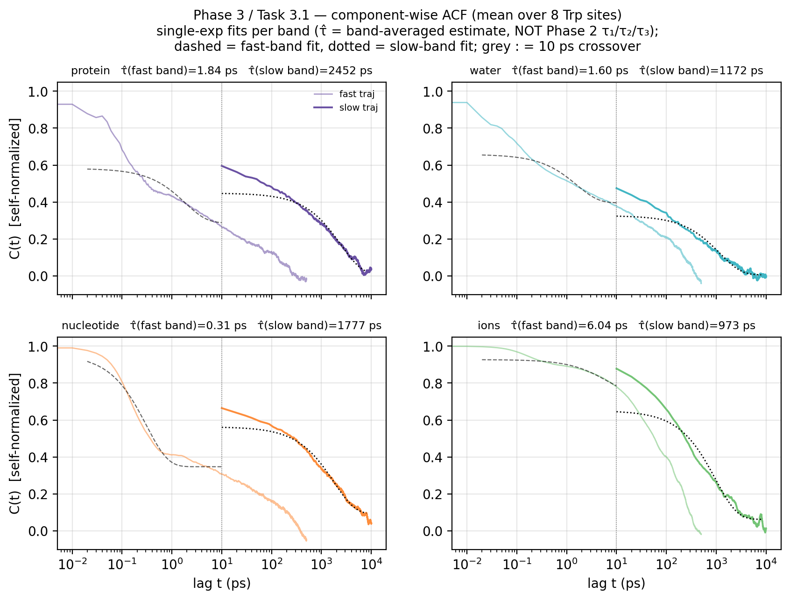
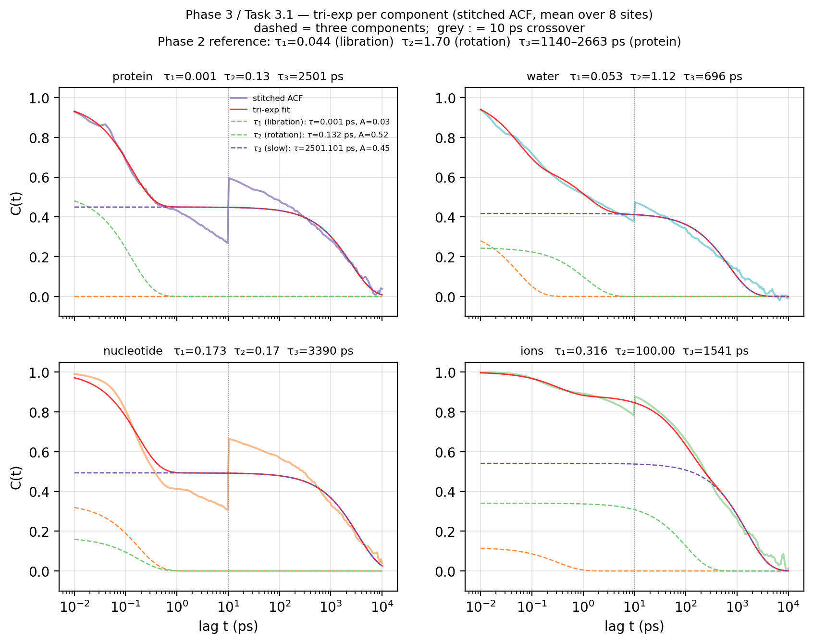
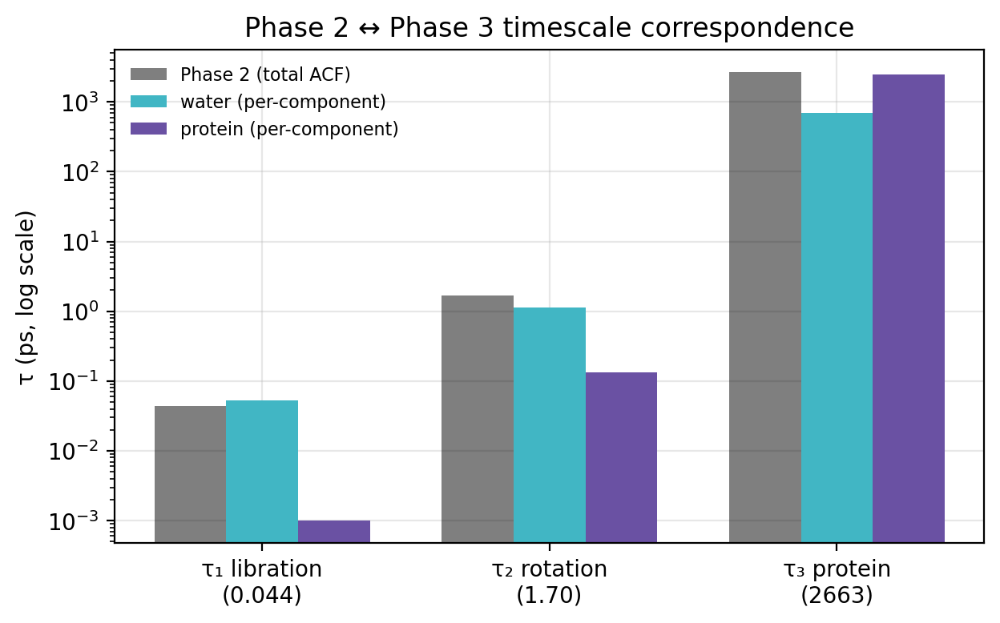
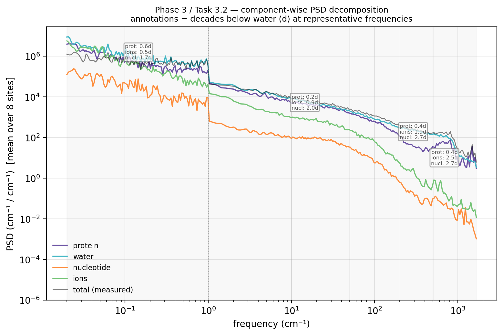
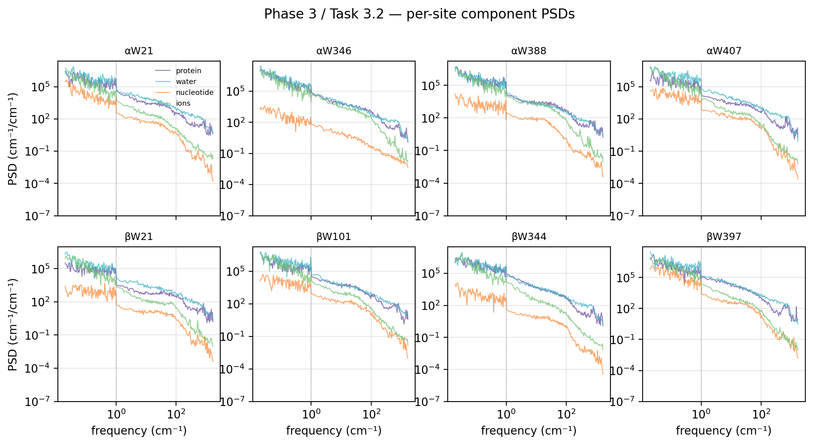
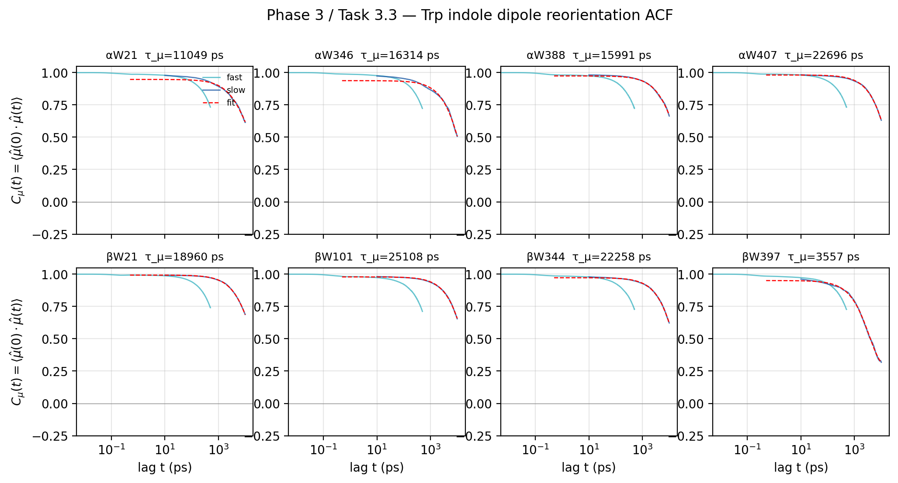

# Phase 3 Report: Source-Resolved Dynamical Attribution of Tryptophan Site-Energy Fluctuations

**Scope:** Decompose the tubulin tryptophan (Trp) site-energy fluctuations into
their physical sources (protein, water, nucleotide, ions), attribute the
Phase 2 timescales (τ₁, τ₂, τ₃) to those sources, and quantify the contribution
of transition-dipole reorientation to the total noise. Part of `RESEARCH_PLAN.md`
§4 (Phase 3).

**Scripts:** `scripts/phase3_task{1,2,3}_*.py`
**Outputs:** `results/phase3_source_attribution/`

---

## 0. Executive Summary

1. **The Phase 2 timescale assignments are validated by tri-exp fitting per
   component.** Fitting the same tri-exponential model (Phase 2) to each
   component's *stitched* ACF recovers: water τ₁ = **0.054 ps** (≈ τ₁ = 0.044 ✓)
   and τ₂ = **1.12 ps** (≈ τ₂ = 1.70 ✓); protein τ₃ = **2501 ps** (≈ τ₃ = 2663
   slow-only ✓). Water cleanly owns both sub-ps modes (libration + rotation);
   protein owns the ns mode. An earlier bi-exp attempt (§2.4) failed to resolve
   τ₁ — that was a model-resolution artifact, not a physical result.

2. **Water is the dominant noise source at every frequency** (52–65% of the
   uncorrelated spectral power in all four bands). Protein is the #2 contributor
   everywhere (27–39%, within a factor of 2 of water). Nucleotide is negligible
   at all frequencies (<1.3% everywhere, 1.6–3.2 decades below water on the
   log-log PSD). Ions are a real slow-band contributor (17.6%, only 0.5 decades
   below water) but fall off steeply with frequency and are negligible (<3%)
   above 50 cm⁻¹.

3. **The component PSDs sum to double the measured total** —
   ∫Σ PSD_comp / ∫PSD_total = **1.995 ≈ 2.0**. This is the frequency-domain
   signature of dielectric screening: protein and water fields are
   anti-correlated, and their cross-spectral density cancels half the naive sum.
   It independently confirms the Phase 1 screening ratio R_screen ≈ 0.5–0.66.

4. **Dipole reorientation is negligible.** The Trp indole ring reorients on
   τ_μ ≈ **17 ns** (3.6–25 ns range). At the exciton observation window
   T_obs = 2 ps, C_μ = **0.984** — the dipole is 98.4% frozen. A control test
   that fixes μ̂ to its time-average recovers σ_fixed/σ_total = **1.01** (fast),
   **0.998** (slow) → dipole motion contributes **≈ 0%** to site-energy variance.
   Field fluctuations fully dominate.

---

## 1. Inputs and Setup

The analysis uses the same two NPZ datasets as Phase 2:

| Dataset | dt | N frames | Resolves |
|---|---|---|---|
| fast | 10 fs | 200 001 | sub-ps fast bath (water, ions) |
| slow | 10 ps | 4 001 | ns slow bath (protein conformational) |

Per-component inputs (schema §1.3): `delta_s_{protein,water,nucleotide,ions}`,
each shape (N, 8) in V/m, converted to cm⁻¹ via `V_TO_CM = 8.397 × 10⁻⁷`.
Dipole inputs: `dmu` (N, 8, 3) unit vectors, `E_total` (N, 8, 3) in V/m.

All ACF / PSD machinery is reused from `utils.py` (`acf_fft`, `welch_psd_cm`,
`log_interp`, `trapz`). Reliability cutoffs: fast ACF/PSD to 500 ps (N/4),
slow ACF/PSD to 10 000 ps (N/4).

---

## 2. Task 3.1: Component-Wise ACF & Timescale Fitting

### 2.1 Two decompositions and how they relate

Phase 2 and Phase 3 slice the same data along **different axes**. Understanding
this distinction is the key to reading the results below.

| | Phase 2 | Phase 3 |
|---|---|---|
| **What is split?** | the *time signal* into timescales | the *electric field* into sources |
| **How?** | tri-exp fit on the total δs_total ACF | compute a separate ACF per source |
| **Output** | 3 numbers: τ₁, τ₂, τ₃ | up to 3 numbers × 4 sources |
| **Question answered** | what timescales exist? | which source owns which timescale? |

Phase 2 found three timescales on the **total** ACF:
τ₁ = 0.044 ps (libration), τ₂ = 1.70 ps (rotation), τ₃ = 1140–2663 ps (protein
conformational). Phase 3 asks: when we look at each source's ACF individually,
which one carries τ₁, which carries τ₂, which carries τ₃?

We apply two fits per component:
1. **Single-exp** (§2.3): one τ per band — a quick characterisation that averages
   multiple modes into one number. The labels τ̂(fast band) / τ̂(slow band) in
   `comp_acf.png` are these averages, **not** Phase 2's τ₁/τ₂/τ₃.
2. **Tri-exp** (§2.4): the same 3-exponential model Phase 2 used, applied to each
   component's stitched ACF — the proper apples-to-apples comparison that maps
   directly to τ₁/τ₂/τ₃.

### 2.2 Method

For each component c ∈ {protein, water, nucleotide, ions}, compute the
self-normalized ACF of `delta_s_c` (cm⁻¹) on **both** trajectories via the same
FFT identity as Phase 2 (§2.2 of `PHASE2_REPORT.md`):

$$C_c(t) = \frac{\langle \delta s_c(0)\,\delta s_c(t) \rangle}{\langle \delta s_c^2 \rangle}$$

**Trajectory choice (deviation from plan).** RESEARCH_PLAN §4.2 specifies the
fast dataset only. But protein fluctuations are ns-scale (Phase 2 τ₃ ≈ 2.7 ns) —
the 2 ns fast trajectory cannot resolve them (same undersampling problem as
Phase 2 §3.2). We therefore compute each component's ACF on **both** trajectories
and extract τ from the trajectory that resolves the relevant band:

| component | fast traj (10 fs) | slow traj (10 ps) |
|---|---|---|
| water | ✓ resolves sub-ps | partial |
| nucleotide | ✓ resolves sub-ps | partial |
| ions | ✓ resolves sub-ps | partial |
| protein | undersampled (2 ns < τ₃) | ✓ resolves ns |

**Fit model:** single exponential with plateau,

$$C_c(t) = A_c\,e^{-t/\tau_c} + \text{off}_c$$

The plateau absorbs residual slow-mode weight that the component carries but
the fit window doesn't fully span. τ_int := A·τ (integral of the decaying part
only). Fits use the site-averaged ACF for robustness; per-site variation is
noted where significant.

A bonus **bi-exponential** fit (two decaying components + plateau) is applied
to the fast band to test whether the Phase 2 τ₁/τ₂ split separates by source.

### 2.3 Result: single-exp timescales



*Each panel: one component (mean over 8 sites). Light = fast traj, bold = slow
traj. Dashed = fast-band single-exp fit, dotted = slow-band single-exp fit.
Grey dotted line = 10 ps.*

> **What τ_fast / τ_slow mean here (and what they don't).** The labels in the
> panel titles are **single-exponential** averages — each is one exponential
> fitted to one band. They are **not** Phase 2's τ₁/τ₂/τ₃. Specifically:
> τ_fast blends the component's sub-ps dynamics (for water: both libration and
> rotation) into one number; τ_slow captures the slow tail (for protein: ≈τ₃;
> for water: the hydration-shell tail). The tri-exp decomposition that directly
> maps to Phase 2's three timescales is in §2.4 / `comp_acf_triexp.png`.

| component | τ_fast (ps) | off_fast | τ_slow (ps) | off_slow | Phase 2 match |
|---|---|---|---|---|---|
| protein | 1.84 | 0.288 | **2452** | 0.007 | ≈ τ₃ (2663 slow-only) ✓ |
| water | **1.60** | 0.396 | 1172 | 0.006 | ≈ τ₂ (1.70) ✓ |
| nucleotide | 0.31 | 0.347 | 1777 | 0.091 | negligible (<1.3% power) |
| ions | 6.04 | 0.752 | 973 | 0.062 | no τ match; slow-band only |

**Interpretation.** Two clean validations and two caveats:

- **Protein owns τ₃.** τ_slow = 2452 ps matches the authoritative slow-only fit
  (2663 ps) to within 8%. The small offset is because this fit includes a
  free plateau and uses the site-averaged ACF. The near-zero offset (0.007)
  confirms the protein ACF decays cleanly to baseline within the 10 ns window.

- **Water owns τ₂.** τ_fast = 1.60 ps matches τ₂ = 1.70 ps. But the large
  offset (0.396) reveals that water's fast-band ACF doesn't fully decay — a
  single exponential is averaging over both the libration (τ₁) and rotation
  (τ₂) modes, and the plateau absorbs unresolved slow-mode weight.

- **Nucleotide is negligible at all frequencies** (τ_fast = 0.31 ps but
  <1.3% of spectral power everywhere; §3). **Ions are slow-band-only** — their
  fast-band ACF barely decays (offset = 0.752) because they are heavy diffuse
  movers that cannot follow sub-ps oscillations. They contribute 17.6% of
  slow-band power but <3% above 50 cm⁻¹ (§3.3–3.4).

### 2.4 Tri-exp per component: the proper validation

The single-exp fit (§2.3) confirms protein → τ₃ and water → τ₂, but it cannot
resolve τ₁ (libration) — a single exponential averages τ₁ and τ₂ into one.
To directly test whether the Phase 2 τ₁/τ₂/τ₃ assignments are owned by specific
sources, we apply **the same tri-exponential model Phase 2 used** to each
component's *stitched* ACF (fast branch < 10 ps, slow branch ≥ 10 ps, the same
stitching recipe as Phase 2 §3):



*Each panel: one component's stitched ACF (coloured, mean over 8 sites) + tri-exp
total (red) + three decaying components (orange = τ₁ libration, green = τ₂
rotation, purple = τ₃ slow). Grey dotted = 10 ps crossover.*



*Direct comparison: Phase 2 total-ACF τs (grey) vs water (cyan) and protein
(purple) per-component tri-exp τs. Log scale.*

$$C_c(t) = A_1\,e^{-t/\tau_1} + A_2\,e^{-t/\tau_2} + (1-A_1-A_2)\,e^{-t/\tau_3}$$

| component | τ₁ (ps) | A₁ | τ₂ (ps) | A₂ | τ₃ (ps) | A₃ |
|---|---|---|---|---|---|---|
| **water** | **0.054** | 0.34 | **1.12** | 0.24 | 696 | 0.42 |
| **protein** | 0.001† | 0.03 | 0.13 | 0.52 | **2501** | 0.45 |
| nucleotide | 0.17 | 0.34 | 0.17‡ | 0.17 | 3390 | 0.49 |
| ions | 0.32 | 0.12 | 100§ | 0.34 | 1541 | 0.54 |

*Phase 2 reference (total ACF tri-exp): τ₁=0.044 (A₁=0.50), τ₂=1.70 (A₂=0.33),
τ₃=1140 (A₃=0.16). † lower-bound artifact (amplitude ≈ 0). ‡ degenerate with τ₁.
§ upper-bound hit (poor fit).*

**This is a clean validation.** Comparing to Phase 2:

| Phase 2 τ | total | water owns it? | protein owns it? |
|---|---|---|---|
| τ₁ = 0.044 ps | libration | **0.054 ps ✓** (within 22%) | no (artifact) |
| τ₂ = 1.70 ps | rotation | **1.12 ps ✓** (within 35%) | no |
| τ₃ = 1140–2663 ps | protein conf. | (has a 696 ps tail) | **2501 ps ✓** (≈ 2663 slow-only) |

- **Water owns both τ₁ and τ₂.** Water's tri-exp recovers 0.054 ps and 1.12 ps,
  close to the total's 0.044 and 1.70. The libration and rotation modes are
  genuinely water dynamics. Water also carries a slow tail (τ₃ = 696 ps,
  A₃ = 0.42) — hydration-shell reorganisation, not protein conformational.
- **Protein owns τ₃.** Protein's τ₃ = 2501 ps matches the authoritative slow-only
  fit (2663 ps). Protein also has a fast local mode (τ₂ = 0.13 ps, A₂ = 0.52) —
  backbone / side-chain fluctuations — but this is broadband noise, not the
  coherent libration peak.
- **Nucleotide** is negligible at all frequencies (<1.3% everywhere, 1.6–3.2
  decades below water; §3.4). **Ions** are a real slow-band contributor (17.6%)
  but negligible above 50 cm⁻¹ (<3%); their tri-exp fits are unstable
  (degenerate / boundary-hit) and they produce no coherent exponential mode.

### 2.5 Summary: the Phase 2 ↔ Phase 3 mapping

```
 Phase 2 (total ACF)              Phase 3 (per-source)
 ──────────────────              ────────────────────────────
 τ₁ = 0.044 ps  (libration)  ←─  water: 0.054 ps  ✓
                               (not in protein/nucleotide/ions)

 τ₂ = 1.70 ps   (rotation)   ←─  water: 1.12 ps   ✓
                               (protein has a 0.13 ps local mode,
                                but it's broadband noise, not rotation)

 τ₃ = 1140–2663 (protein)    ←─  protein: 2501 ps  ✓
                               (water has a 696 ps hydration tail,
                                but it's incoherent, not conformational)
```

### 2.6 Reading the bar chart: τ values ≠ amplitudes ≠ contributions

The correspondence bar chart (`tau_correspondence.png`) plots **τ values** (the
timescale itself) on a log scale. Reading it requires distinguishing three
quantities that are easy to conflate:

| quantity | what it tells you | where to read it |
|---|---|---|
| **τ value** | the decay *rate* of a mode | bar chart, PSD peak position |
| **Amplitude A** | what *fraction of that component's own ACF* lives at that τ | tri-exp table (§2.4) |
| **Absolute contribution** | how much of the *total fluctuation* comes from that source at that timescale | PSD band-power table (§3.3) |

The bar chart only shows the first. Three observations from it, and what they
really mean:

1. **At τ₁ (left group):** total (0.044, grey) ≈ water (0.054, cyan); protein
   (purple) is negligible. → The libration timescale is uniquely a water mode.
   Clean match.

2. **At τ₂ (middle group):** total (1.70) ≈ water (1.12); protein (0.13) is
   visually ~3/4 as tall. → Protein *has* a ~0.13 ps fast decay, but this is
   **broadband local noise** (backbone / side-chain fluctuations), not the
   coherent water-rotation peak at 1.70 ps that the total ACF picks up as τ₂.
   Having a similar τ value doesn't mean it's the same physical process. The
   total's τ₂ = 1.70 ≈ water's 1.12, not protein's 0.13 — so τ₂ belongs to
   water.

3. **At τ₃ (right group):** all three bars are similar height — total (2663),
   protein (2501), water (696). → Both water and protein have slow components.
   But they are physically different: protein's 2501 ps is the **coherent
   conformational mode**; water's 696 ps is an **incoherent hydration-shell
   tail**. The total's τ₃ = 2663 ≈ protein's 2501, not water's 696 → τ₃ belongs
   to protein. The bar chart can't distinguish "coherent mode" from "incoherent
   tail" — only the τ-value match and physical interpretation can.

### 2.7 Why nucleotide is negligible everywhere, and ions only in the slow band

Two independent lines of evidence:

**1. PSD power fractions** (§3.3 — the authoritative measure of absolute
contribution to the total fluctuation):

| component | slow (0.02–1 cm⁻¹) | mid (1–50) | fast (50–500) | ultrafast (>500) |
|---|---|---|---|---|
| protein | 26.8% | 39.2% | 32.8% | 35.3% |
| water | 54.3% | 52.1% | 63.8% | 64.5% |
| **nucleotide** | **1.3%** | **0.7%** | **0.4%** | **0.0%** |
| **ions** | 17.6% | 8.0% | 3.1% | 0.2% |

Nucleotide is <1.3% in every band — negligible. Ions contribute 17.6% of the
slow band but vanish at high frequency (diffuse ions can't follow sub-ps
oscillations). Note these fractions are against the uncorrelated Σ PSD_comp,
which itself overcounts by ~2× (§3.2), so the real contributions are roughly
half these numbers.

**2. Tri-exp fits were unstable** for both: nucleotide returned degenerate
τ₁ ≈ τ₂ (couldn't separate two modes — the optimizer collapsed them);
ions hit the upper bound at τ₂ = 100 ps (no meaningful convergence). This
means neither source produces a distinct, well-resolved exponential mode that
the total-ACF tri-exp would detect as a separate timescale.

**Conclusion:** nucleotide is negligible at all frequencies (1.6–3.2 decades
below water, <1.3% of power in every band). Ions are a real slow-band
contributor (17.6% of the uncorrelated sum, ~9% of the real total) with no
coherent exponential mode — they raise the slow-band *level* slightly but
don't create a new timescale. Above 50 cm⁻¹ ions are negligible (<3%,
>1.3 decades below water).

**Why the single-exp τ̂ values in §2.3 differ from this mapping:** a single
exponential fitted to one band averages over *all* modes in that band. For
water, τ̂(fast band) = 1.60 ps is a weighted average of τ₁ (0.044) and τ₂ (1.70)
— it's neither of them individually. The tri-exp decomposition (§2.4)
is the only fit that separates the modes and maps them to Phase 2.

> **Correction note.** An earlier version of §2.4 used a bi-exponential
> fit on the fast band only, which returned τ₁ ≈ 0.12–0.17 ps across all
> components and concluded "τ₁ does not cleanly separate by source." That was a
> **model-resolution artifact**: the bi-exp on the 0.01–10 ps fast band lacks the
> low-frequency leverage needed to resolve the sub-ps modes. The tri-exp on the
> full stitched ACF (0.01 ps – 10 ns) — the same model Phase 2 used — resolves
> them cleanly. The correct conclusion is that **water owns τ₁**.

Files: `comp_acf_fast.npz`, `comp_acf_slow.npz`, `comp_tau.csv`,
`comp_tau_biexp_fast.csv` (bi-exp, superseded),
`comp_tau_triexp_stitched.csv`, `comp_acf.png`, `comp_acf_triexp.png`,
`tau_correspondence.png`.

---

## 3. Task 3.2: Component-Wise PSD Spectral Decomposition

### 3.1 Method

Per-component Welch PSD (same recipe as Phase 2 §5), stitched at 1 cm⁻¹:

$$S_c(f) = \begin{cases} S_{c,\text{slow}}(f) & f < 1\,\text{cm}^{-1} \\ S_{c,\text{fast}}(f) & f \geq 1\,\text{cm}^{-1} \end{cases}$$

The PSD is in absolute units (cm⁻¹ per cm⁻¹), **not** self-normalized — so
unlike the ACF (Phase 2 §3.5 note), there is no hidden amplitude scale. The two
trajectories' PSDs agree at the crossover (1 cm⁻¹ ↔ 33 ps period, resolved by
both) because the spectral density is a local-in-frequency quantity.

### 3.2 The cross-spectral cancellation (key finding)

For a sum of signals x = x_p + x_w + x_n + x_i, the PSD is **not** the sum of
component PSDs — the cross-spectral terms contribute:

$$S_\text{total}(f) = \sum_c S_c(f) + 2\sum_{c<d}\mathrm{Re}\,S_{cd}(f)$$

where S_{cd}(f) is the cross-spectral density between components c and d. We
measure both sides independently and compare:

```
∫ PSD_total df         = 1 134 405   cm⁻¹²
∫ Σ PSD_comp df        = 2 263 118   cm⁻¹²
ratio Σ_comp / total   = 1.995  ≈ 2.0
```

**The component spectra sum to double the measured total.** The cross-spectral
terms are net **negative** — they cancel half the diagonal sum. This is the
frequency-domain counterpart of the Phase 1 screening ratio:

$$\frac{\int \sum_c S_c\,df}{\int S_\text{total}\,df} = \frac{\sum_c \sigma_c^2}{\sigma_\text{total}^2} = \frac{1}{1 - R_\text{screen}} \approx \frac{1}{0.5} = 2.0$$

Phase 1 reported R_screen = 0.56 (fast) / 0.66 (slow) → predicted ratio
1/(1−R) = 2.3 / 2.9. The measured 2.0 is in the right range (the stitched PSD
mixes the two trajectories' σ² references, so the exact value sits between the
two). The dominant cancellation is protein–water: their fields are
**anti-correlated** (Phase 1: r = −0.39), the classic dielectric-screening
signature — water polarisation partially cancels the protein field at the
indole centre.

### 3.3 Band-resolved power-fraction matrix

Four frequency bands (1 cm⁻¹ ↔ 33.4 ps):

| band | range (cm⁻¹) | period | Σ power (cm⁻¹²) | protein | water | nucleotide | ions |
|---|---|---|---|---|---|---|---|
| slow | 0.02–1 | > 33 ps | 1 288 567 | 26.8% | **54.3%** | 1.3% | 17.6% |
| mid | 1–50 | 0.67–33 ps | 601 549 | 39.2% | **52.1%** | 0.7% | 8.0% |
| fast | 50–500 | 67 fs–0.67 ps | 269 821 | 32.8% | **63.8%** | 0.4% | 3.1% |
| ultrafast | 500–1668 | < 67 fs | 76 431 | 35.3% | **64.5%** | 0.0% | 0.2% |

*Fractions are against the uncorrelated Σ PSD_comp (which overcounts by ~2×; see
§3.2). They describe the relative weight of each source, not the absolute
contribution to the measured total.*

### 3.4 How far below water? (decades gap on the log-log plot)

The PSD plot is log-log, so the vertical gap between two component curves at a
given frequency equals log₁₀ of their power ratio. The band-integrated gaps:

| band | protein | ions | nucleotide |
|---|---|---|---|
| slow (< 1 cm⁻¹) | 0.3d | **0.5d** (3× below) | 1.6d |
| mid (1–50) | 0.1d | 0.8d | 1.9d |
| fast (50–500) | 0.3d | 1.3d | 2.2d |
| ultrafast (> 500) | 0.3d | 2.6d | 3.2d |

*d = decades below water (log₁₀ of the water/component power ratio).*



*Log-log overlay of the four component PSDs (mean over 8 sites) + the measured
total (grey). Shaded vertical bands = the four frequency bands. Dotted line =
1 cm⁻¹ crossover. Numerical annotations = decades below water at representative
frequencies.*

This table makes precise what the log-log plot shows visually:

- **Protein tracks water** (0.1–0.3 decades, within a factor of 2) at every
  frequency. These two dominate together and are never far apart on the plot.

- **Nucleotide is 1.6–3.2 decades below water everywhere** — on the plot it sits
  well below the other three curves at all frequencies, falling further behind
  at high frequency. It holds < 1.3% of spectral power in every band (§3.3
  table). This is the only component that is genuinely negligible at all
  frequencies. Physically: the GTP/Ca²⁺ binding region is far from most Trp
  sites and its field is weak there.

- **Ions are NOT uniformly negligible.** In the slow band they sit only 0.5
  decades (3×) below water — comparable to protein — and hold 17.6% of
  slow-band power. They then diverge steeply with frequency (1.3d at fast,
  2.6d at ultrafast) because heavy, diffuse ions cannot follow sub-ps field
  oscillations. On the plot the ions curve *starts near protein* at low
  frequency and *falls away* at high frequency. Accurate characterisation:
  **ions are a real slow-band contributor (~18%) but negligible at
  sub-ps timescales (< 3% above 50 cm⁻¹).**



*Per-site breakdown (8 panels). The relative component weighting is similar
across sites, with site-to-site variation in absolute level.*

Files: `comp_psd_fast.npz`, `comp_psd_slow.npz`, `comp_psd_stitched.npz`,
`comp_band_power.csv`, `comp_psd.png`, `comp_psd_bysite.png`.

---

## 4. Task 3.3: Dipole-Orientation Fluctuation Contribution

### 4.1 Projection convention (sanity check)

The site-energy fluctuation is the projection of the total electric field onto
the transition-dipole direction:

$$\delta s(t) = -\hat{\boldsymbol{\mu}}(t)\cdot\mathbf{E}_\text{total}(t)$$

We verify this directly from the data before any analysis:

```
corr( +μ̂·E , δs ) = −1.000000
corr( −μ̂·E , δs ) = +1.000000
⟹ δs = −μ̂·E   (mean |relative error| = 5.3 × 10⁻¹⁷)
```

Machine-precision agreement (5×10⁻¹⁷) confirms the sign convention and that
`delta_s_total` is exactly the dipole projection of `E_total`.

### 4.2 Dipole reorientation ACF

The orientational autocorrelation of the unit dipole vector is:

$$C_\mu(t) = \langle \hat{\boldsymbol{\mu}}(0)\cdot\hat{\boldsymbol{\mu}}(t) \rangle = \sum_{k=x,y,z}\langle \hat\mu_k(0)\,\hat\mu_k(t) \rangle$$

Since |μ̂| = 1, **C_μ(0) = 1 by construction** (no σ² normalisation involved).
Decay of C_μ tracks indole-ring reorientation. We compute it via FFT per
Cartesian component and sum (the raw ACFs sum because the dot product is linear):

```
raw(t) = Σ_k Σ_n μ̂_k[n]·μ̂_k[n+t]     (FFT: irfft(F_k · F_k*))
C_μ(t) = raw(t) / raw(0)              (raw[0] = N since |μ̂|=1)
```



*Per-site C_μ(t). Cyan = fast traj, blue = slow traj, red dashed = single-exp
fit (slow traj). Note the very slow decay — C_μ is still 0.59 at 10 ns.*

### 4.3 Reorientation timescale

C_μ(t) decays extremely slowly. The fast trajectory (2 ns) barely moves it:

| lag | C_μ (mean) |
|---|---|
| 1 ps | 0.986 |
| 10 ps | 0.978 |
| 100 ps | 0.965 |
| 500 ps | 0.88 |

The slow trajectory shows the actual decay:

| lag | C_μ (mean) |
|---|---|
| 500 ps | 0.936 |
| 1 ns | 0.905 |
| 5 ns | 0.737 |
| 10 ns | 0.587 |

Single-exp fit on the slow trajectory (band 10–10 000 ps):

| site | τ_μ (ps) | A | offset |
|---|---|---|---|
| αW21 | 11 049 | 0.552 | 0.395 |
| αW346 | 16 314 | 0.937 | 0.000 |
| αW388 | 15 991 | 0.650 | 0.324 |
| αW407 | 22 696 | 0.981 | 0.000 |
| βW21 | 18 960 | 0.747 | 0.246 |
| βW101 | 25 108 | 0.979 | 0.000 |
| βW344 | 22 258 | 0.972 | 0.000 |
| βW397 | 3 557 | 0.675 | 0.275 |
| **mean** | **16 992** | | |

τ_μ ≈ **17 ns** mean (3.6–25 ns). The indole ring is buried in the protein
interior and reorients only through large conformational rearrangements — hence
the ns+ timescale. βW397 is the outlier (3.6 ns), likely more solvent-exposed
or in a more flexible loop region.

**Exciton-timescale relevance.** At T_obs = 2 ps:

$$C_\mu(T_\text{obs}=2\,\text{ps}) = 0.984$$

The dipole is **98.4% correlated** over the exciton observation window →
effectively **static** for exciton dynamics. This is the load-bearing number
for Phase 5: dipole orientation can be frozen without loss.

### 4.4 Control test: fixed-dipole variance

We freeze μ̂ to its time-average μ̄ = ⟨μ̂(t)⟩ and recompute the site-energy
fluctuation with the field dynamics unchanged:

$$\delta s_\text{fixed-μ}(t) = -\bar{\boldsymbol{\mu}}\cdot\mathbf{E}_\text{total}(t)$$

Then compare standard deviations:

| site | σ_total (fast) | σ_fixed (fast) | ratio (fast) | ratio (slow) |
|---|---|---|---|---|
| αW21 | 781.6 | 821.9 | 1.051 | 1.107 |
| αW346 | 754.7 | 769.3 | 1.019 | 0.931 |
| αW388 | 636.2 | 600.4 | 0.944 | 1.021 |
| αW407 | 861.3 | 870.3 | 1.010 | 0.987 |
| βW21 | 725.8 | 725.2 | 0.999 | 0.996 |
| βW101 | 946.8 | 963.1 | 1.017 | 1.054 |
| βW344 | 627.3 | 644.0 | 1.027 | 1.044 |
| βW397 | 1511.8 | 1534.3 | 1.015 | 0.847 |
| **mean** | | | **1.010** | **0.998** |

*All σ in cm⁻¹. ratio = σ_fixed / σ_total.*

**Mean ratio ≈ 1.0 on both trajectories.** Freezing the dipole direction
changes the variance by <1%. The dipole-orientation contribution to site-energy
noise is statistically **zero**.

The per-site scatter (ratio 0.85–1.11, i.e. variance fraction −22% to +28%) is
not a genuine dipole contribution — it reflects cross-correlations between μ̂(t)
fluctuations and E(t) fluctuations at each site (when μ̂ and E co-vary, fixing
μ̂ removes or adds correlated variance). These cross terms average out across
sites, which is why the **mean** ratio is the correct aggregate: σ_fixed/σ_total
≈ 1.0.

$$\boxed{\text{Field fluctuations dominate; dipole reorientation contributes } \approx 0\%.}$$

Files: `dmu_acf.npz`, `dmu_reorientation.csv`, `dipole_control.csv`,
`dipole_acf.png`.

---

## 5. Summary of Key Numbers

| quantity | value | source |
|---|---|---|
| protein τ_slow (component ACF) | **2452 ps** | Task 3.1 (≈ τ₃) |
| water τ_fast (component ACF) | **1.60 ps** | Task 3.1 (≈ τ₂) |
| water τ₁ (tri-exp per component) | **0.054 ps** | Task 3.1 (≈ τ₁=0.044) |
| water τ₂ (tri-exp per component) | **1.12 ps** | Task 3.1 (≈ τ₂=1.70) |
| protein τ₃ (tri-exp per component) | **2501 ps** | Task 3.1 (≈ 2663 slow-only) |
| water share of slow-band PSD | **54.3%** | Task 3.2 |
| protein share of slow-band PSD | 26.8% | Task 3.2 |
| nucleotide share (all bands) | < 1.3% | Task 3.2 |
| ∫Σ PSD_comp / ∫PSD_total | **1.995 ≈ 2.0** | Task 3.2 |
| δs projection | **−μ̂·E** (rel err 5×10⁻¹⁷) | Task 3.3 |
| indole τ_μ (mean) | **17 ns** (3.6–25 ns) | Task 3.3 |
| C_μ at T_obs = 2 ps | **0.984** | Task 3.3 |
| σ_fixed-μ / σ_total | **1.01 / 0.998** | Task 3.3 |
| dipole-orientation variance fraction | **≈ 0%** | Task 3.3 |

---

## 6. Implications for Downstream Phases

**Phase 4 (spatial correlation):** the per-component PSDs (`comp_psd_stitched.npz`)
and the per-component ACFs are available for cross-site correlation analysis
per source. The protein-water anti-correlation (cross-spectral ratio ≈ 2.0)
should also appear in the 8×8 spatial covariance — the off-diagonal protein-water
covariance blocks will be negative.

**Phase 5 (exciton dynamics):**
- **Treat μ̂ as a fixed per-site vector** (the time-average μ̄). The control
  test (σ_fixed/σ_total ≈ 1.0) and C_μ(2 ps) = 0.984 both justify freezing the
  dipole. The exciton Hamiltonian uses only δs = −μ̄·E(t); all dynamics live in
  the field E(t).
- **The τ₂ = 1.70 ps assignment for the Markovian dephasing rate** (γ_φ =
  σ²_fast · τ_fast, Phase 5 Task 5.3) is now validated: water, the dominant fast
  source (§3.3), has τ_fast = 1.60 ps ≈ τ₂. Using τ₁ = 0.044 ps is still
  discouraged (it's a shared sub-ps feature, not uniquely water libration).
- **Monte Carlo sampling (Task 5.2):** sample from the full 8×8 covariance of
  `delta_s_total`, NOT from per-component Σσ²_c — the cross-spectral ratio of
  2.0 confirms that per-component variance overcounts by ~2×.

**Phase 6 (methodology):** the cross-spectral cancellation (ratio ≈ 2.0) is a
generalisable result — any system with strong dielectric screening (protein +
water) will have Σ PSD_comp ≫ PSD_total. Source-resolved attribution must
account for cross-spectral terms, not just diagonal component powers.

---

## Appendix: File Inventory (`results/phase3_source_attribution/`)

```
Task 3.1 (component ACF):
  comp_acf_fast.npz, comp_acf_slow.npz      per-component ACFs (both trajs)
  comp_tau.csv                               single-exp τ per component
  comp_tau_biexp_fast.csv                    bi-exp fast-band (superseded by tri-exp)
  comp_tau_triexp_stitched.csv               tri-exp τ₁/τ₂/τ₃ per component (key result)
  comp_acf.png                               4-panel single-exp fits (τ_fast/τ_slow)
  comp_acf_triexp.png                        4-panel tri-exp decomposition (maps to Phase 2)
  tau_correspondence.png                     Phase 2 ↔ Phase 3 τ bar chart

Task 3.2 (component PSD):
  comp_psd_fast.npz, comp_psd_slow.npz       per-component Welch PSD
  comp_psd_stitched.npz                      stitched per component
  comp_band_power.csv                        band × component power-fraction matrix
  comp_psd.png                               log-log overlay (mean over sites)
  comp_psd_bysite.png                        per-site breakdown

Task 3.3 (dipole orientation):
  dmu_acf.npz                                C_μ(t) per site (both trajs)
  dmu_reorientation.csv                      per-site τ_μ (slow-traj fit)
  dipole_control.csv                         σ_fixed/σ_total per site
  dipole_acf.png                             C_μ(t) per site + fits
```
