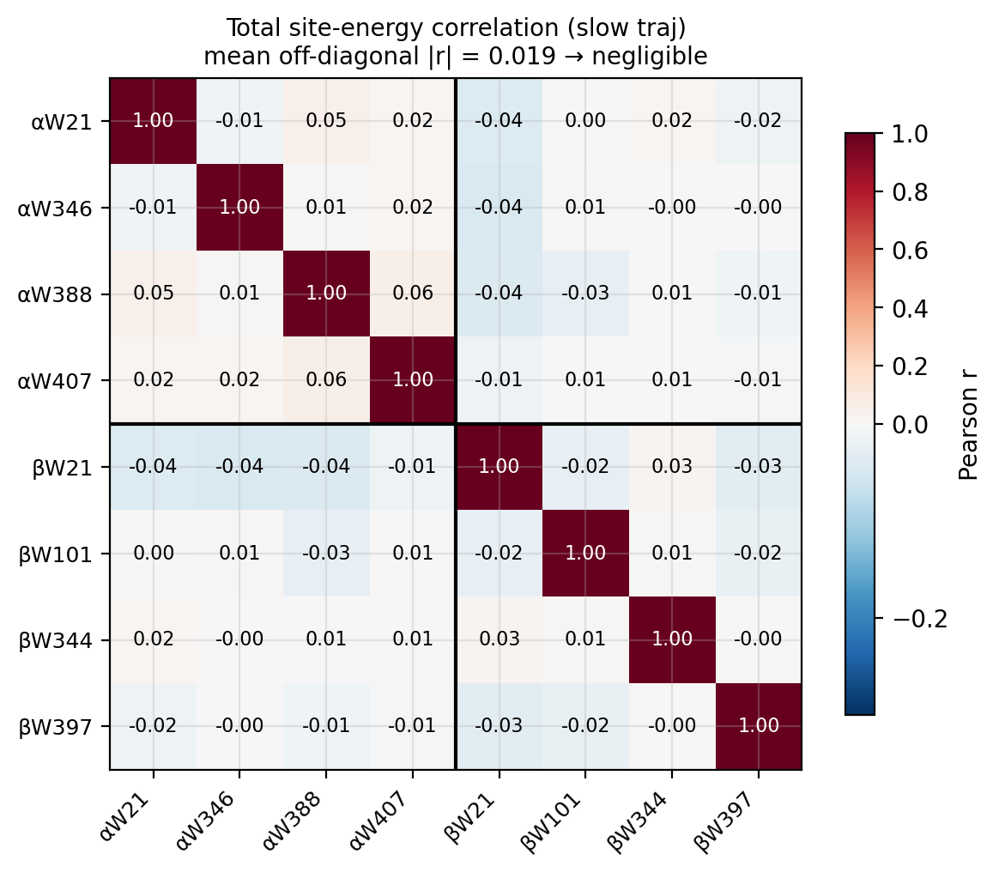

# Phase 4 Report: Spatial Correlation

**Bottom line:** spatial correlations between Trp site-energy fluctuations are
negligible. The independent-site assumption holds.

---

## Result

The 8×8 Pearson correlation matrix for total site-energy fluctuations (slow
trajectory):

Mean off-diagonal |r| = **0.019** (slow traj), **0.030** (fast traj). Both
are statistically indistinguishable from zero (z = 0.98σ). The matrix is
effectively diagonal.

## Phase 5 implication

Treat the 8 sites as independent. The covariance matrix
(`results/phase4_spatial_correlation/corr_cov_slow.npz`, key `total`) is
well-conditioned (cond = 4.7) and nearly diagonal (off-diag/diag = −0.003).
Use per-site σ_total on the diagonal.

## Scripts

- `scripts/phase4_task1_correlation_matrix.py` — 8×8 Pearson + covariance matrices
- `scripts/phase4_task2_cross_correlation.py` — temporal cross-correlation (also negligible)
