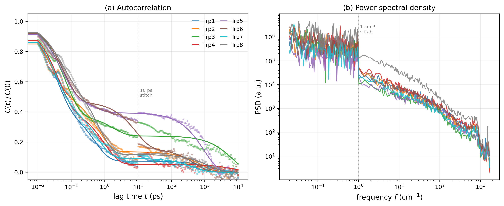
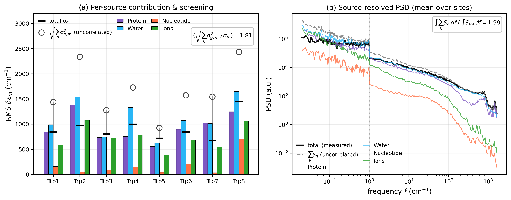
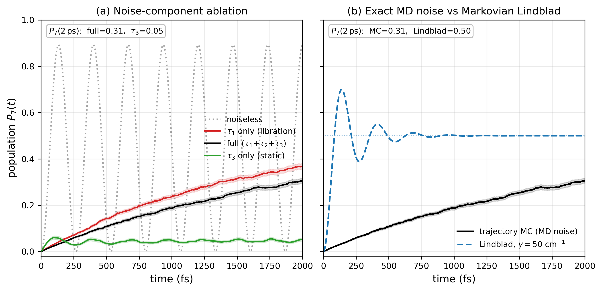
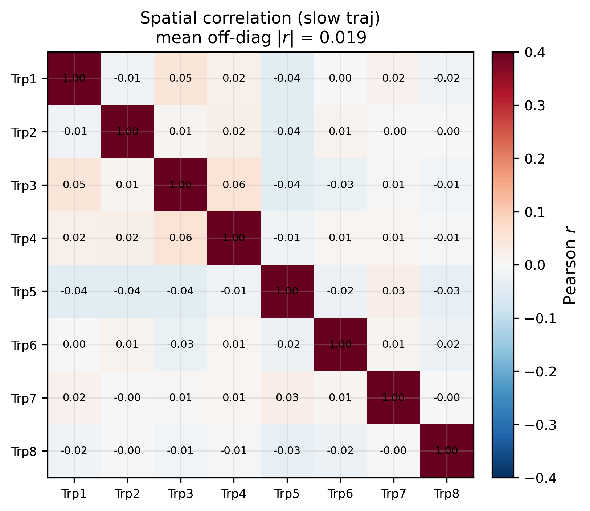
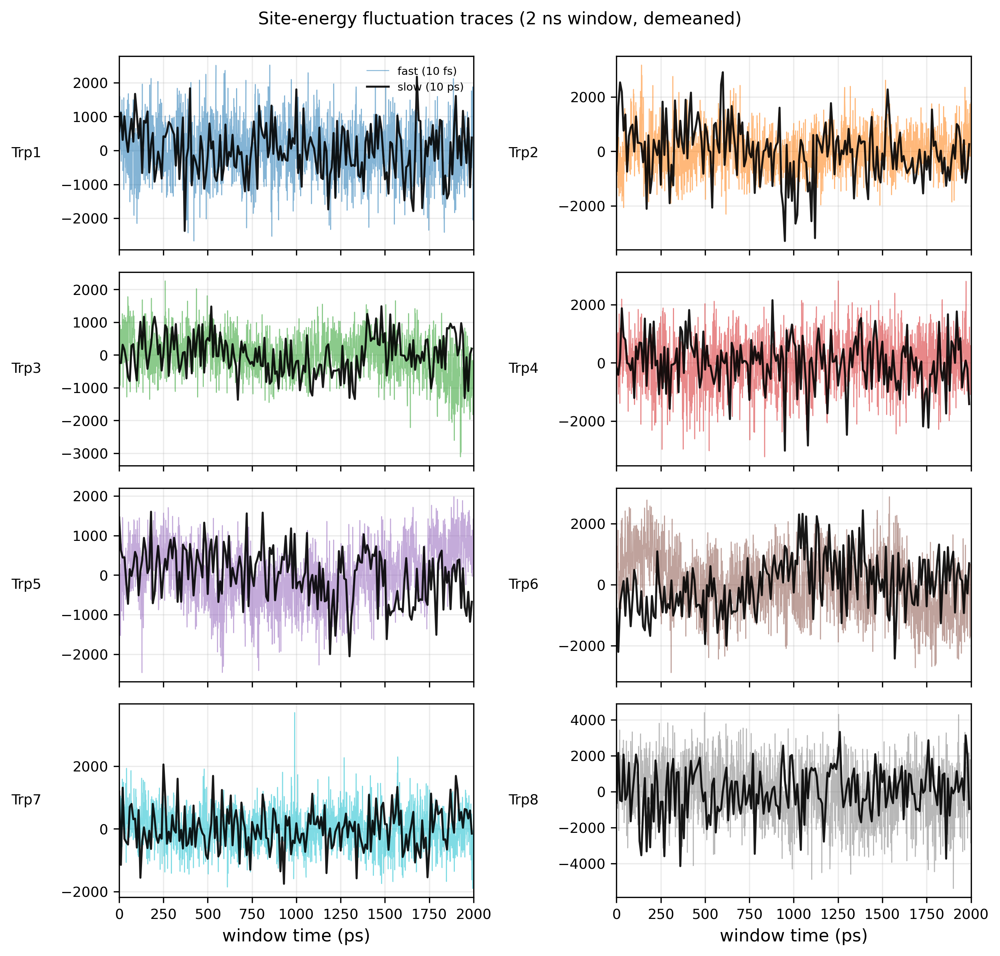
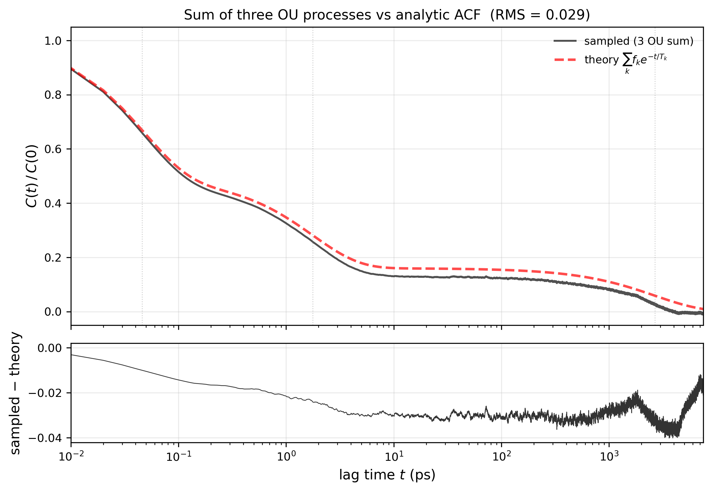

# Results

> **Working title candidates**
> 1. Multi-timescale noise forbids long-range coherent exciton transport in the tubulin tryptophan network
> 2. Fast solvent fluctuations enable incoherent hopping but not coherent delocalization in tubulin
>
> **Style.** Concise, compact, accurate. Symbols and abbreviations are consistent; abbreviations are expanded at first use.

## Conventions

The eight tryptophan (Trp) sites of the tubulin αβ-dimer are referred to as **Trp1–Trp8** throughout. Their correspondence to the chain/residue labels is:

| | chain A (α) | | chain B (β) | |
|---|---|---|---|---|
| Trp1 | αW21 | | Trp5 | βW21 |
| Trp2 | αW346 | | Trp6 | βW101 |
| Trp3 | αW388 | | Trp7 | βW344 |
| Trp4 | αW407 | | Trp8 | βW397 |

Colours used in the figures: fluctuation sources — protein (purple), water (blue), nucleotide (orange), ions (yellow); the eight Trp sites use a fixed 8-colour palette.

## Data

Two MD trajectories resolve complementary timescales of the site-energy fluctuations $\delta\varepsilon_m(t)$, the Linear Stark shift of each Trp ${\rm S}_0{\to}{\rm S}_1$ transition: $\delta\varepsilon_m=-\Delta\boldsymbol\mu_m\cdot\mathbf E_m(t)$, where $\Delta\boldsymbol\mu_m=\boldsymbol\mu_e-\boldsymbol\mu_g$ is the ground-to-excited **difference dipole** (change in permanent dipole, $|\Delta\mu|=5$ D — distinct from the transition dipole) and $\mathbf E_m(t)$ is the all-atom electric field at the indole. Both trajectories share identical MD configurations taken after deep thermal equilibration (underlying integrator step 2 fs); they differ only in output cadence.

| trajectory | $\Delta t$ | frames | span | Nyquist | resolves |
|---|---|---|---|---|---|
| slow | 10 ps | 4 001 | 40 ns (10–50 ns) | 1.67 cm⁻¹ | nanosecond bath |
| fast | 10 fs | 200 001 | 2 ns (0–2 ns) | 1668 cm⁻¹ | sub-picosecond bath |

Energies are reported in cm⁻¹, times in ps (with fs/ns where natural). The excitonic coupling uses the Craddock 2014 Hamiltonian; the strongest pair is Trp4–Trp7 with $J=-59$ cm⁻¹ (all other pairs $|J|\le 6$ cm⁻¹).

---

## 1. Magnitude and statistics of the fluctuations

**Table 1.** Per-site fluctuation characterisation (slow trajectory $\sigma$; corrected tri-exponential fit parameters $f_k,T_k$, see below; all times in ps).

| site | σ (cm⁻¹) | σ/J | f₁ | T₁ (ps) | f₂ | T₂ (ps) | f₃ | T₃ (ps) |
|---|---|---|---|---|---|---|---|---|
| Trp1 | 844 | 18.8 | 0.56 | 0.036 | 0.36 | 0.51 | 0.07 | 1926 |
| Trp2 | 972 | 21.6 | 0.46 | 0.027 | 0.40 | 0.64 | 0.14 | 776 |
| Trp3 | 806 | 17.9 | 0.62 | 0.068 | 0.14 | 1.77 | 0.24 | 6820 |
| Trp4 | 999 | 22.2 | 0.57 | 0.041 | 0.37 | 1.00 | 0.05 | 8524 |
| Trp5 | 721 | 16.0 | 0.47 | 0.050 | 0.13 | 0.41 | 0.39 | 957 |
| Trp6 | 846 | 18.8 | 0.53 | 0.062 | 0.31 | 8.58 | 0.16 | 492 |
| Trp7 | 675 | 15.0 | 0.52 | 0.034 | 0.38 | 0.58 | 0.09 | 452 |
| Trp8 | 1453 | 32.3 | 0.36 | 0.047 | 0.52 | 0.65 | 0.12 | 1358 |
| **mean** | **914** | **20.3** | 0.51 | 0.046 | 0.33 | 1.77 | 0.16 | 2663 |

The standard deviation of the slow trajectory, $\sigma_m$, is taken as the total fluctuation amplitude (it samples the nanosecond modes the 2 ns fast trajectory undersamples; $\sigma^2_{\rm slow}/\sigma^2_{\rm fast}=1.21$ on average). The ratio $\sigma_m/J$ ranges from 15 (Trp7) to 32 (Trp8), placing every site deep in the **strong-disorder** regime ($\sigma/J\gg 1$), for which Anderson localisation of the exciton is expected.

The fluctuations are approximately Gaussian: across all sites the skewness lies in $[-0.32,\,+0.32]$. This justifies treating the autocorrelation (or equivalently the power spectrum) as a complete second-order descriptor and, later, Gaussian Monte-Carlo sampling of the bath.

## 2. Three well-separated relaxation timescales

Autocorrelations $C_m(t)=\langle\delta\varepsilon_m(0)\delta\varepsilon_m(t)\rangle/\sigma_m^2$ are computed independently on both trajectories and **stitched** at the only defensible crossover, $t=10$ ps (the slow trajectory's first lag): the fast ACF for $t<10$ ps, the slow ACF for $t\ge 10$ ps. The power spectra are stitched analogously at $f=1$ cm⁻¹. Because each ACF is self-normalised, the per-trajectory variance mismatch is absorbed into the normalisation; absolute variance re-enters downstream via $\sigma_m$.

**Figure 1.** (a) Stitched autocorrelations (dots) with tri-exponential fits (solid lines) for all eight Trps. (b) Stitched power spectral densities. Vertical dotted lines mark the 10 ps / 1 cm⁻¹ stitch.

The stitched ACFs are decisively described by a **tri-exponential**

$$C_m(t)=f_1\,e^{-t/T_1}+f_2\,e^{-t/T_2}+f_3\,e^{-t/T_3},\qquad f_1+f_2+f_3=1,$$

rather than a bi-exponential ($\Delta{\rm AIC}=-331$ on the stitched ACF, decisive; the Akaike criterion ${\rm AIC}=n\ln({\rm RSS}/n)+2k$ penalises extra parameters, so a model cannot win merely by overfitting).

**Extracting an unbiased $T_3$ across the stitch.** The stitch at 10 ps is not physically smooth: each ACF is self-normalised (by $\sigma^2_{\rm fast}$ or $\sigma^2_{\rm slow}$), and since the slow trajectory captures extra nanosecond variance ($\sigma^2_{\rm slow}/\sigma^2_{\rm fast}=1.21$), the slow curve sits $\sim$0.04 above the fast curve at the crossover — a normalisation artefact, not a real feature. (i) Fitting the tri-exponential straight across this discontinuity yields a high $R^2=0.989$ but **underestimates** $T_3$ (system mean $1.1$ ns): the optimiser bends the slow decay faster in order to absorb the upward jump. (ii) We therefore read $T_3$ instead from the only trajectory that resolves the nanosecond mode — a single-exponential fit on the 50 ns slow ACF alone, which contains no discontinuity — giving an unbiased per-site $T_3$ (system mean $2.66$ ns). We then refit the two fast components on the stitched ACF with $T_3$ anchored to this value. This corrected tri-exponential has $R^2=0.987$ (minimum $0.97$; RMS residual $0.027$) — a negligible cost ($0.002$ in $R^2$) for removing the bias — and is the single model used in Table 1, Fig. 1, and the exciton simulation. The three system-mean timescales and their physical assignment (validated independently in §3) are

| mode | timescale | weight | origin |
|---|---|---|---|
| $T_1$ | **46 fs** | 0.51 | water libration |
| $T_2$ | **1.77 ps** | 0.33 | water rotation / H-bond reformation |
| $T_3$ | **2.66 ns** | 0.16 | protein conformational |

The slow timescale is broadly distributed across sites ($T_3=0.5$–$8.5$ ns), reflecting heterogeneous local protein environments; the system mean is $2.66$ ns. The fast modes together carry 84% of the ACF weight ($f_1+f_2=0.84$); only 16% is slow.

**Dipole frozen.** The difference dipole is effectively static on the exciton timescale: its orientational correlation is $C_\mu(2\,{\rm ps})=0.984$, with reorientation time $\tau_\mu\approx 17$ ns. Freezing $\Delta\boldsymbol\mu_m$ to its time-average and recomputing $\delta\varepsilon_m$ reproduces the variance to within 0.2% ($\sigma_{\rm fixed}/\sigma_{\rm total}=0.998$). All dynamics therefore live in the field $\mathbf E_m(t)$; the difference dipole is held fixed in everything that follows.

## 3. Source decomposition and dielectric screening

Because the field decomposes linearly ($\mathbf E=\sum_g\mathbf E_g$, $g\in\{$protein, water, nucleotide, ions$\}$), so does the site energy: $\delta\varepsilon_m=\sum_g\delta\varepsilon_{g,m}$.

**Figure 2.** (a) Per-source RMS $\sigma_{g,m}$ (bars) with the measured total $\sigma_m$ (black) and the uncorrelated expectation $\sqrt{\sum_g\sigma_{g,m}^2}$ (open circles). The gap between the two markers is the cross-source cancellation. (b) Source-resolved PSD, averaged over the eight sites, with the measured total in grey.

**Water dominates every frequency band** (54% of the slow band, 52–65% across all bands); protein is consistently second (27–39%). Nucleotide is negligible everywhere (<1.3%); ions contribute only in the slow band (~18%) and vanish at sub-ps frequencies.

**Dielectric screening.** The component spectra sum to **twice** the measured total: $\int\sum_g S_g\,df\,/\,\int S_{\rm tot}\,df=2.0$. Equivalently, the screening ratio $R_{\rm screen}=1-\sigma_m^2/\sum_g\sigma_{g,m}^2=0.66$ on average — cross-source terms cancel two-thirds of the naive variance sum. The dominant cancellation is protein–water, whose fluctuations are anti-correlated ($r=-0.39$): polarised water partially cancels the protein field at the indole. **Any noise model that treats sources as independent overestimates $\sigma$ by $\sim\sqrt{2}$.**

The timescale assignment of §2 is independently confirmed by fitting the tri-exponential to each source's own ACF: water recovers $T_1\approx 54$ fs and $T_2\approx 1.1$ ps; protein recovers $T_3\approx 2.5$ ns. The temporal decomposition (§2) and the source decomposition (§3) converge from orthogonal directions on the same three timescales.

## 4. Impact of static and dynamic noise on exciton dynamics

We solve the stochastic Schrödinger equation for the Trp4–Trp7 dimer ($J=-59$ cm⁻¹, site-energy offset $\Delta\varepsilon=41$ cm⁻¹ from the Craddock diagonal), with per-site coloured noise synthesised as the sum of three Ornstein–Uhlenbeck (OU) processes using the §2 parameters and per-site $\sigma_m$ (Trp4: 999 cm⁻¹; Trp7: 675 cm⁻¹). For each of $N_{\rm MC}=500$ realisations the Hamiltonian

$$H(t)=J\sigma_x+\tfrac{\Delta\varepsilon}{2}\sigma_z+\delta\varepsilon_4(t)|4\rangle\langle 4|+\delta\varepsilon_7(t)|7\rangle\langle 7|$$

is propagated unitarily ($\Delta t=2$ fs, $T_{\rm obs}=2$ ps) and the observables ensemble-averaged. This is exact for classical Gaussian noise: no Born–Markov, no perturbation theory, no rotating-wave approximation. (The OU discretisation is the analytic SDE solution, not Euler–Maruyama; the sum's ACF matches the analytic $\sum_k f_k e^{-t/T_k}$ to an RMS residual of 0.028, Appendix C.) The two sites are treated as independent, justified by the near-vanishing spatial correlations (Appendix A, mean off-diagonal $|r|=0.019$).

**Figure 3.** Population $P_7(t)$ starting from Trp4. (a) Noise-component ablation. (b) Trajectory MC (full MD noise) versus the Craddock-2014 Haken–Strobl Lindblad ($\gamma=50$ cm⁻¹) on the same dimer.

| noise configuration | $P_7(2\,{\rm ps})$ | character |
|---|---|---|
| noiseless | 0.89 peak | Rabi oscillation |
| $T_1$ only (libration) | 0.37 | smooth monotonic rise |
| $T_2$ only (rotation) | 0.34 | smooth monotonic rise |
| $T_1{+}T_2{+}T_3$ (full) | 0.31 | same, slightly damped by the static component |
| $T_3$ only (static) | **0.05** | weak oscillation, localised |

**Fast fluctuations drive incoherent transfer; static disorder traps.** With only the slow component $T_3$ the per-realisation energy gap stays far from resonance ($\sigma_{\Delta}/J\gg 1$), so the excitation remains on Trp4 — the Anderson-localised limit. Adding the fast components lets $\Delta\varepsilon(t)$ cross resonance repeatedly; each crossing opens a transfer window driven by $J$, and the ensemble-averaged population rises monotonically, without coherent oscillation, to $\sim 0.31$. This is **environment-assisted quantum transport**: the noise is not merely decoherence to be minimised but the transport mechanism itself.

**Comparison to the Markovian treatment.** Craddock (2014) modelled dephasing with a Haken–Strobl Lindblad at a fixed rate $\gamma=50$ cm⁻¹ ($1/\gamma=106$ fs). On the same dimer this predicts $P_7(2\,{\rm ps})=0.50$, markedly higher than the exact coloured-noise result (0.31). The discrepancy is the non-Markovian regime: the Kubo numbers $\kappa_k=\sigma_k T_k/\hbar$ are $\gg 1$ for all three components (5–10 for $T_1$, 165 for $T_2$, $\sim 10^5$ for $T_3$), so the white-noise assumption underlying the Lindblad master equation is violated. A trajectory treatment of the realistic MD-derived bath is therefore essential; the Markovian rate is a fit parameter, not an ab initio prediction.

---

## Appendix A — Spatial correlations

**Figure A1.** $8\times 8$ Pearson correlation matrix of the site-energy fluctuations (slow trajectory). Mean off-diagonal $|r|=0.019$. The sites are statistically independent; the exciton-dynamics treatment uses a diagonal covariance.

## Appendix B — Fluctuation traces

**Figure A2.** Two-nanosecond windows of $\delta\varepsilon_m(t)$ for each Trp: the fast trajectory (colour, 10 fs cadence) overlaid with the last 2 ns of the slow trajectory (black, 10 ps cadence), both demeaned. The coarse slow trace resolves the nanosecond envelope; the fast trace resolves the sub-picosecond jitter invisible at 10 ps sampling.

## Appendix C — OU process sampling

The coloured bath is generated as a sum of three independent OU processes, each evolved by the exact discretisation

$$x(t+\Delta t)=x(t)\,e^{-\Delta t/T}+\sqrt{1-e^{-2\Delta t/T}}\;\sigma\sqrt{f}\;\xi(t),\qquad \xi(t)\sim\mathcal N(0,1).$$

**Figure A3.** ACF of the OU sum (a single 30 ns trajectory, five-realisation average) versus the analytic target $\sum_k f_k e^{-t/T_k}$. RMS residual $=0.028$ over 10 fs–7.5 ns, confirming the sampler reproduces the fitted statistics.

## Appendix D — Structural descriptors

| site | whole-residue SASA (nm²) | dipole mobility $\theta_{\rm loc}$ (deg) | nearest nucleotide | $d_{\rm nucl}$ (Å) | hydration |
|---|---|---|---|---|---|
| Trp1 | 0.194 | 12.9 | GTP | 14.2 | 1.71 |
| Trp2 | 0.703 | 15.0 | GTP | 29.2 | 2.19 |
| Trp3 | 0.046 | 12.7 | GTP | 14.5 | 0.13 |
| Trp4 | 0.488 | 8.3 | GTP | 12.2 | 2.36 |
| Trp5 | 0.029 | 8.6 | GDP | 13.8 | 0.48 |
| Trp6 | 0.066 | 10.0 | GDP | 10.1 | 0.83 |
| Trp7 | 0.157 | 10.0 | GTP | 19.7 | 1.52 |
| Trp8 | 1.003 | 31.9 | GDP | 9.9 | 3.87 |

SASA is the whole-residue solvent-accessible area (Lee–Richards, 50 ns trajectory); $\theta_{\rm loc}$ is the Procrustes-corrected local angular deviation of the difference dipole (the orientational analogue of RMSF); $d_{\rm nucl}$ is the distance to the nearest GTP/GDP. These structural descriptors contextualise the site heterogeneity but correlate only weakly with the relaxation times ($|r|<0.43$ for $\sigma$–SASA and $\tau_k$–SASA), confirming that bath memory is not determined by solvent exposure alone. Notable: Trp8 is the outlier on every axis — highest $\sigma$, largest SASA, highest mobility, closest to a nucleotide, most hydrated.
